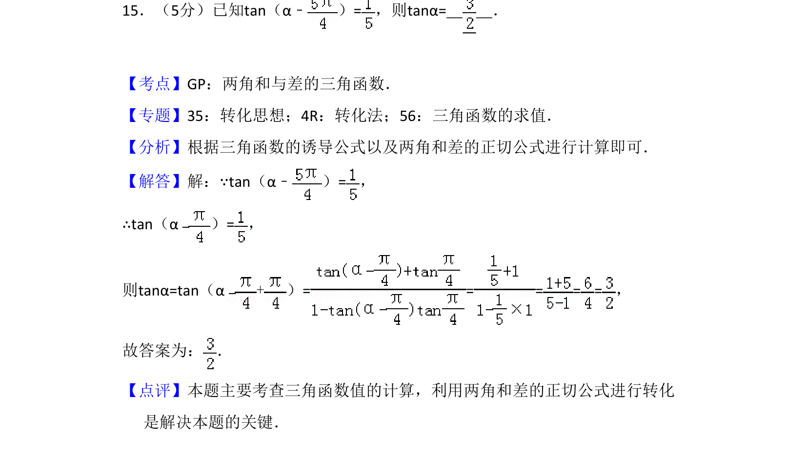
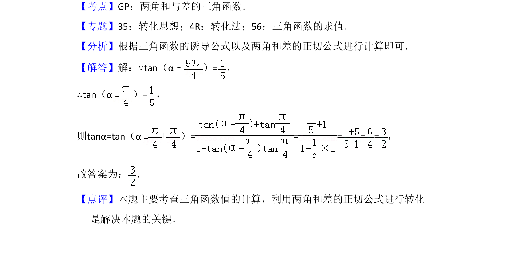

## 题面

## 摘要

本题给出 tan(α-π/4) 的值，利用两角和的正切公式间接求 tanα。

## 关联考点

- [[629-两角和与差的正切公式|两角和与差的正切公式]]
- [[272-三角恒等变换|三角恒等变换]]
- [[1124-转化与化归思想|转化与化归思想]]

## 答案与解析

> 📄 原 PDF 第 11 页：`素材/真题/吉林/2008-2024·（吉林）数学高考真题/2018年高考数学试卷（文）（新课标Ⅱ）（解析卷）.pdf`
