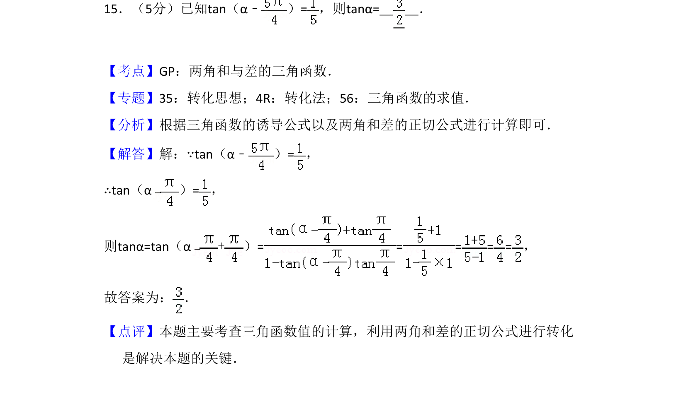
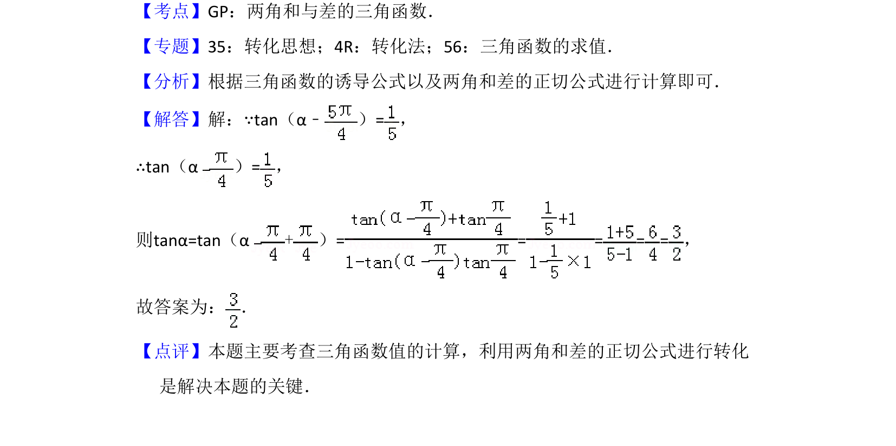

## 题面

## 摘要

本题给出 tan(α-π/4) 的值，利用两角和的正切公式间接求 tanα。

## 关联考点

- [[629-两角和与差的正切公式|两角和与差的正切公式]]
- [[272-三角恒等变换|三角恒等变换]]
- [[1124-转化与化归思想|转化与化归思想]]

## 答案与解析

> 📄 原 PDF 第 11 页：`素材/真题/吉林/2008-2024·（吉林）数学高考真题/2018年高考数学试卷（文）（新课标Ⅱ）（解析卷）.pdf`

<!-- 题干文本-start -->
## 题干文本
15．（5分）已知tan（α﹣ ）=，则tanα=　 　．
<!-- 题干文本-end -->

<!-- 解析文本-start -->
## 解析文本
【考点】GP：两角和与差的三角函数．菁优网版权所有
【专题】35：转化思想；4R：转化法；56：三角函数的求值．
【分析】根据三角函数的诱导公式以及两角和差的正切公式进行计算即可．
【解答】解：∵tan（α﹣ ）=，
∴tan（α）=，
则tanα=tan（α+）= = = = =，
故答案为： ．
【点评】本题主要考查三角函数值的计算，利用两角和差的正切公式进行转化
是解决本题的关键．
<!-- 解析文本-end -->
