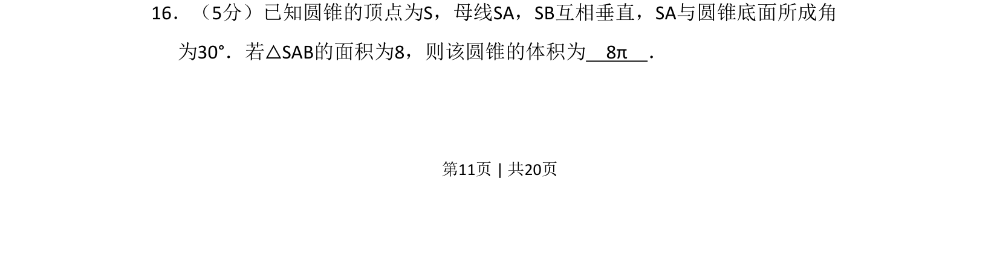
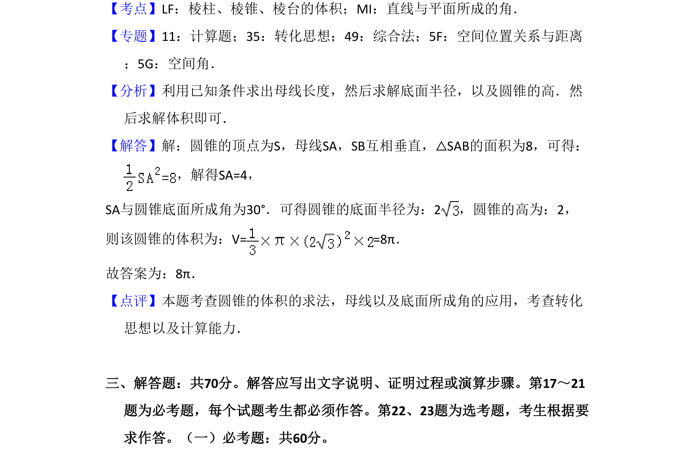

## 题面

## 摘要

已知圆锥母线垂直和线面角，由三角形面积求母线长，再计算圆锥体积。

## 关联考点

- [[784-圆锥几何|圆锥几何]]
- [[353-空间角|线面角]]
- [[062-多边形面积|三角形面积]]
- [[651-体积公式|体积公式]]

## 答案与解析

> 📄 原 PDF 第 11 页：`素材/真题/吉林/2008-2024·（吉林）数学高考真题/2018年高考数学试卷（文）（新课标Ⅱ）（解析卷）.pdf`
