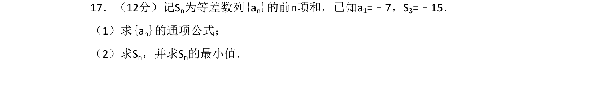
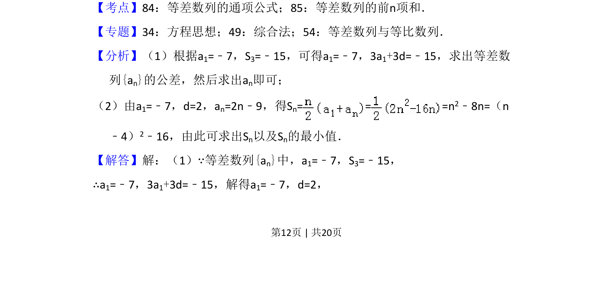
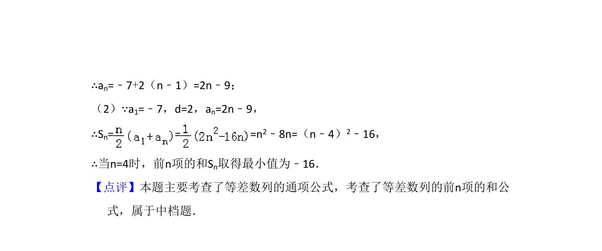

## 题面

## 摘要

已知等差数列首项及前3项和，求通项公式及前n项和的最小值。

## 关联考点

- [[1062-等差数列的通项公式|等差数列的通项公式]]
- [[1060-等差数列的前n项和|等差数列的前n项和]]

## 答案与解析

> 📄 原 PDF 第 12 页：`素材/真题/吉林/2008-2024·（吉林）数学高考真题/2018年高考数学试卷（文）（新课标Ⅱ）（解析卷）.pdf`
