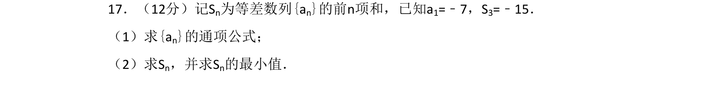
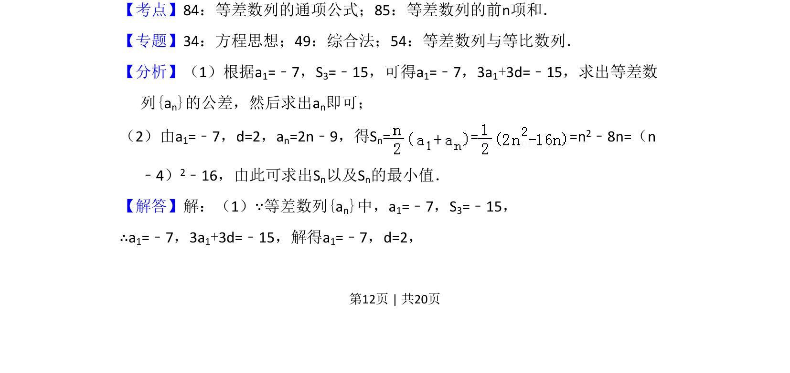
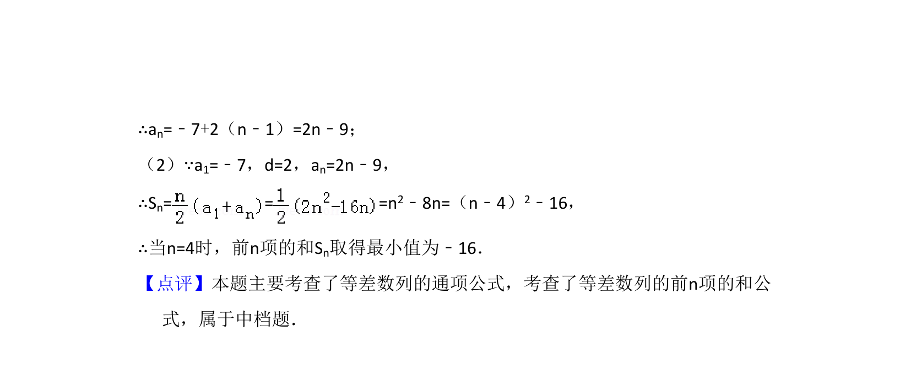

## 题面

## 摘要

已知等差数列首项及前3项和，求通项公式及前n项和的最小值。

## 关联考点

- [[1063-等差数列通项公式|等差数列的通项公式]]
- [[355-等差数列前n项和|等差数列的前n项和]]

## 答案与解析

> 📄 原 PDF 第 12 页：`素材/真题/吉林/2008-2024·（吉林）数学高考真题/2018年高考数学试卷（文）（新课标Ⅱ）（解析卷）.pdf`

<!-- 题干文本-start -->
## 题干文本
17．（12分）记Sn为等差数列{an}的前n项和，已知a1=﹣7，S3=﹣15．
（1）求{an}的通项公式；
（2）求Sn，并求Sn的最小值．
<!-- 题干文本-end -->

<!-- 解析文本-start -->
## 解析文本
【考点】84：等差数列的通项公式；85：等差数列的前n项和．菁优网版权所有
【专题】34：方程思想；49：综合法；54：等差数列与等比数列．
【分析】（1）根据a1=﹣7，S3=﹣15，可得a1=﹣7，3a1+3d=﹣15，求出等差数
列{an}的公差，然后求出an即可；
（2）由a1=﹣7，d=2，an=2n﹣9，得Sn= = =n 2﹣8n=（n
﹣4）2﹣16，由此可求出Sn以及Sn的最小值．
【解答】解：（1）∵等差数列{an}中，a1=﹣7，S3=﹣15，
∴a1=﹣7，3a1+3d=﹣15，解得a1=﹣7，d=2，
<!-- 解析文本-end -->
