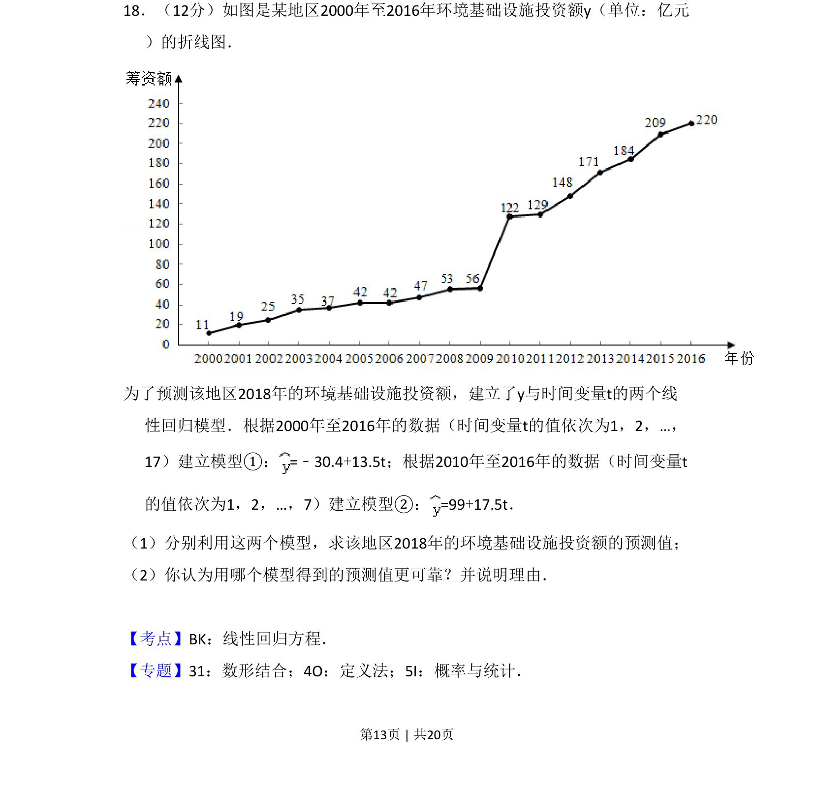
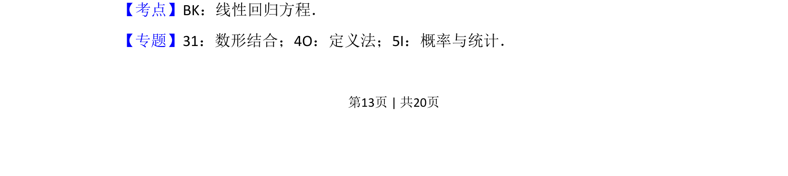
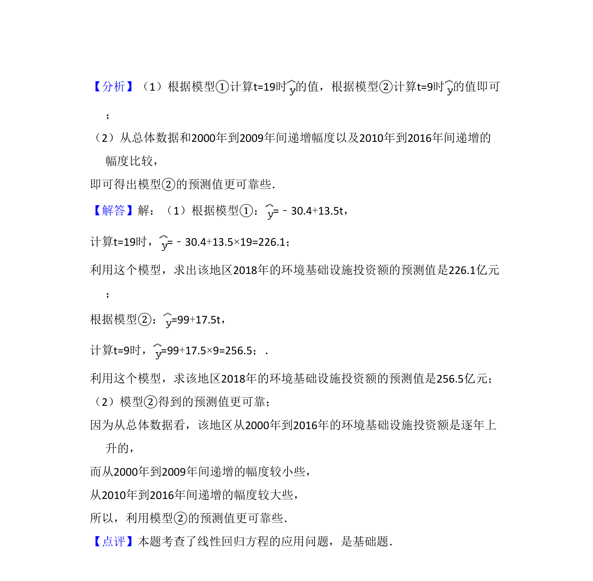

## 题面

## 摘要

本题给出环境和投资额折线图，要求利用两个线性回归模型预测2018年投资额并判断模型可靠性。

## 关联考点

- [[481-回归直线方程|线性回归方程]]
- [[471-prediction|预测]]
- [[模型评价]]

## 答案与解析

> 📄 原 PDF 第 13 页：`素材/真题/吉林/2008-2024·（吉林）数学高考真题/2018年高考数学试卷（文）（新课标Ⅱ）（解析卷）.pdf`
