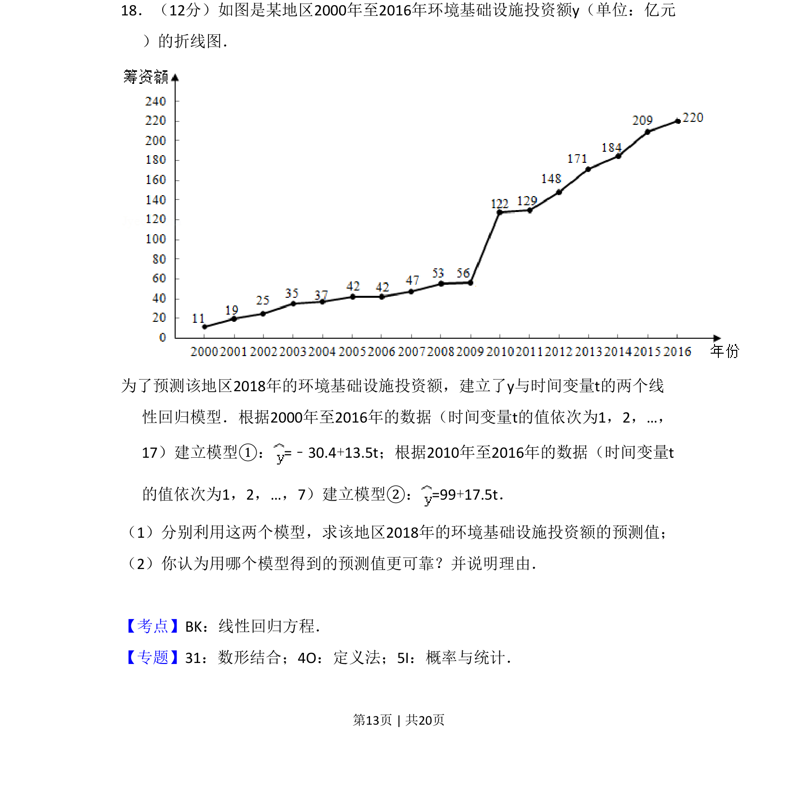
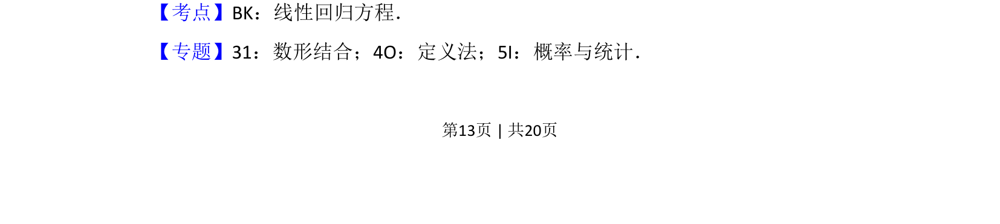
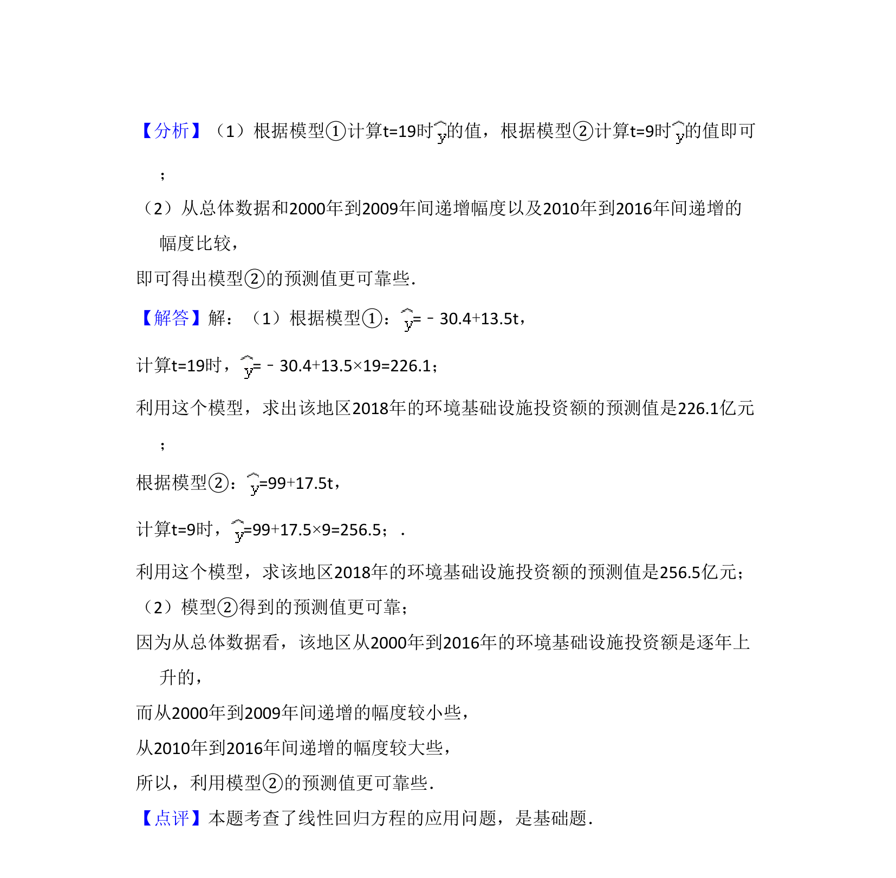

## 题面

## 摘要

本题给出环境和投资额折线图，要求利用两个线性回归模型预测2018年投资额并判断模型可靠性。

## 关联考点

- [[481-回归直线方程|线性回归方程]]
- [[471-prediction|预测]]
- [[950-模型评价|模型评价]]

## 答案与解析

> 📄 原 PDF 第 13 页：`素材/真题/吉林/2008-2024·（吉林）数学高考真题/2018年高考数学试卷（文）（新课标Ⅱ）（解析卷）.pdf`

<!-- 题干文本-start -->
## 题干文本
18．（12分）如图是某地区2000年至2016年环境基础设施投资额y（单位：亿元
）的折线图．
为了预测该地区2018年的环境基础设施投资额，建立了y与时间变量t的两个线
性回归模型．根据2000年至2016年的数据（时间变量t的值依次为1，2，…，
17）建立模型①：=﹣30.4+13.5t；根据2010年至2016年的数据（时间变量t
的值依次为1，2，…，7）建立模型②：=99+17.5t．
（1）分别利用这两个模型，求该地区2018年的环境基础设施投资额的预测值；
（2）你认为用哪个模型得到的预测值更可靠？并说明理由．
<!-- 题干文本-end -->

<!-- 解析文本-start -->
## 解析文本
【考点】BK：线性回归方程．菁优网版权所有
【专题】31：数形结合；4O：定义法；5I：概率与统计．
<!-- 解析文本-end -->
