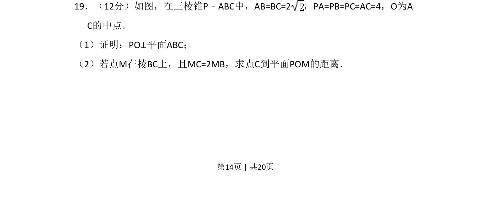
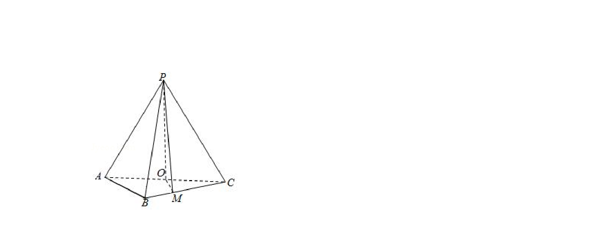
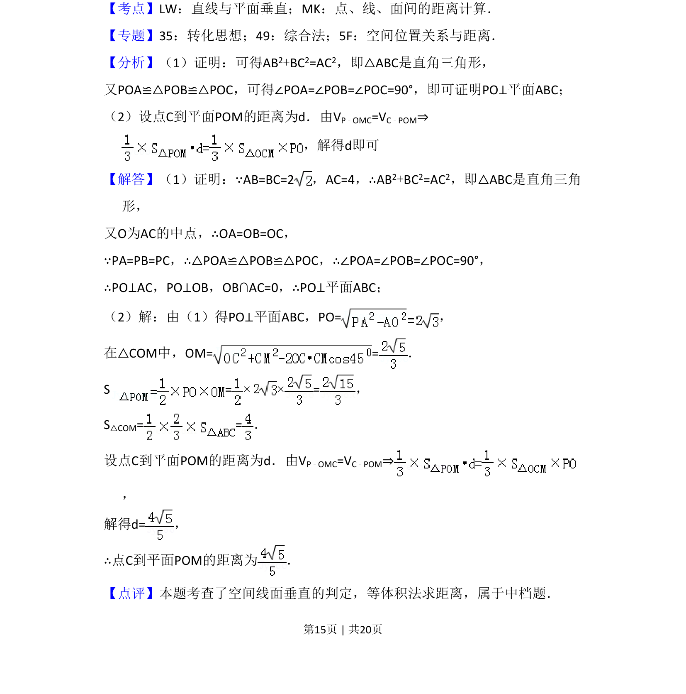

## 题面

## 摘要

在三棱锥中证明线面垂直，并求点到平面的距离

## 关联考点

- [[1085-线面垂直的判定|线面垂直的判定]]
- [[1196-点面距离计算|点到平面的距离]]
- [[1057-等体积法|等体积法]]

## 答案与解析

> 📄 原 PDF 第 14 页：`素材/真题/吉林/2008-2024·（吉林）数学高考真题/2018年高考数学试卷（文）（新课标Ⅱ）（解析卷）.pdf`
