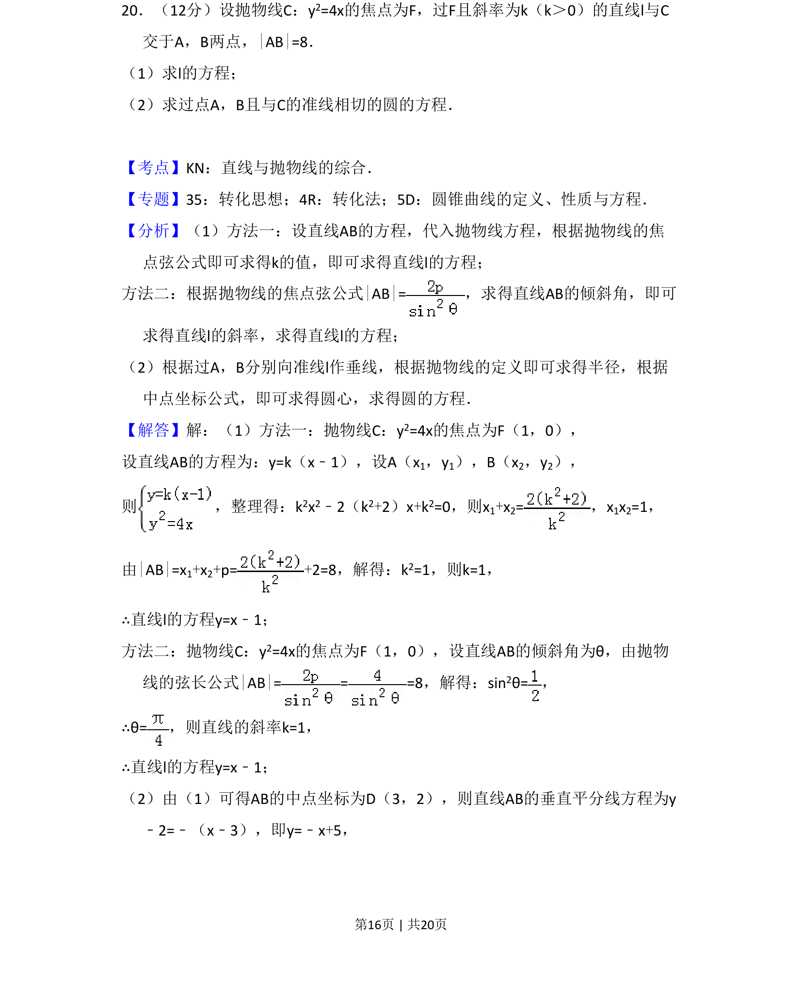
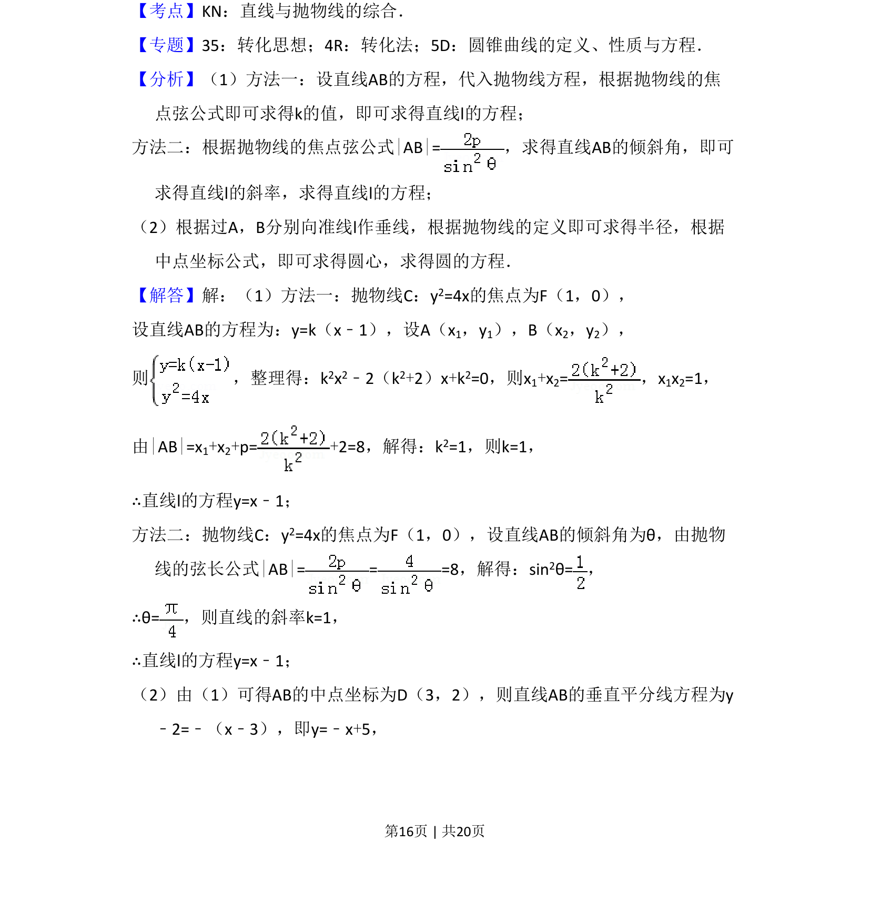
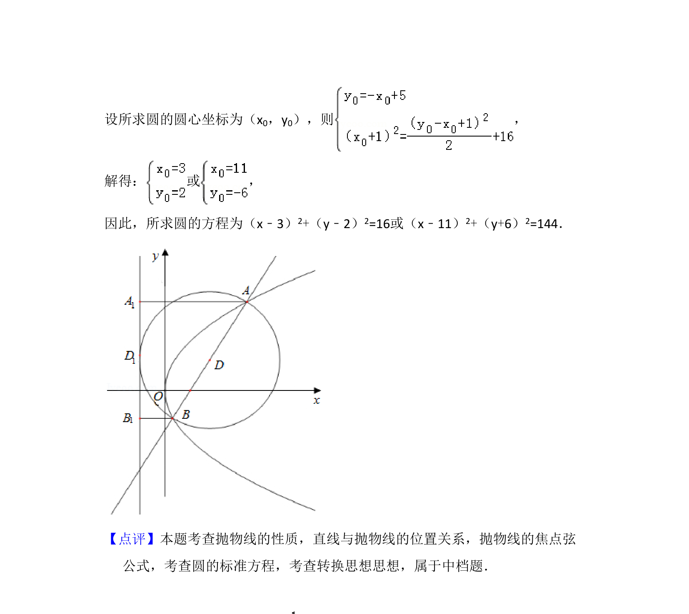

## 题面

## 摘要

考查抛物线与直线相交的焦点弦问题，并求过交点与准线相切的圆的方程。

## 关联考点

- [[直线与抛物线的综合]]
- [[380-抛物线焦点弦|焦点弦]]
- [[373-圆的标准方程|圆的标准方程]]
- [[抛物线的定义]]

## 答案与解析

> 📄 原 PDF 第 16 页：`素材/真题/吉林/2008-2024·（吉林）数学高考真题/2018年高考数学试卷（文）（新课标Ⅱ）（解析卷）.pdf`
