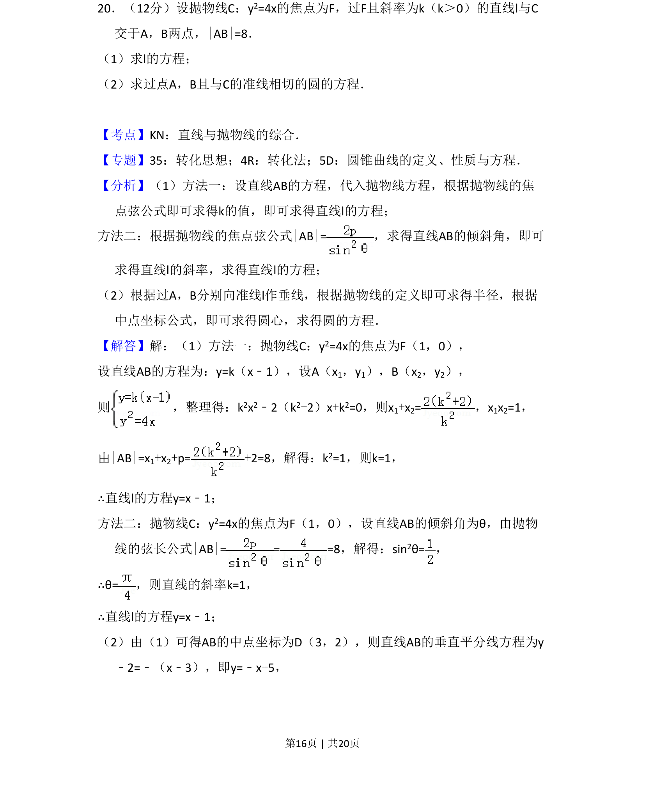
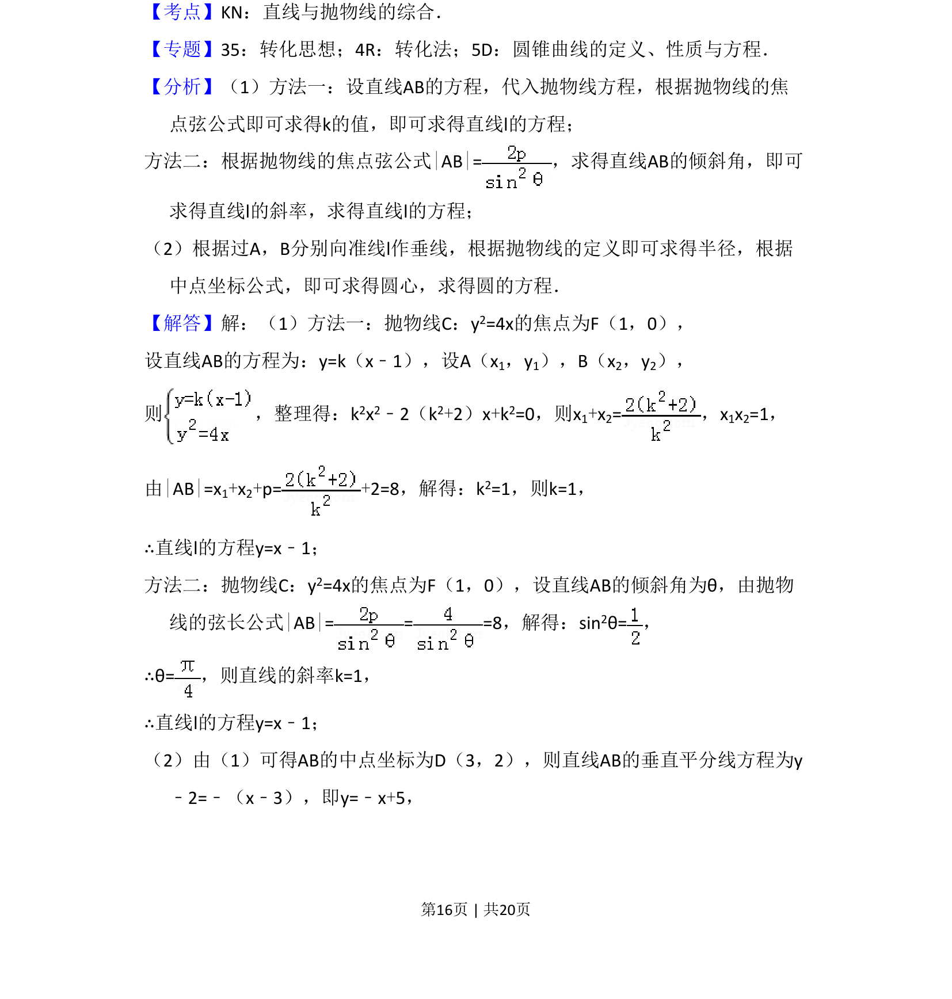
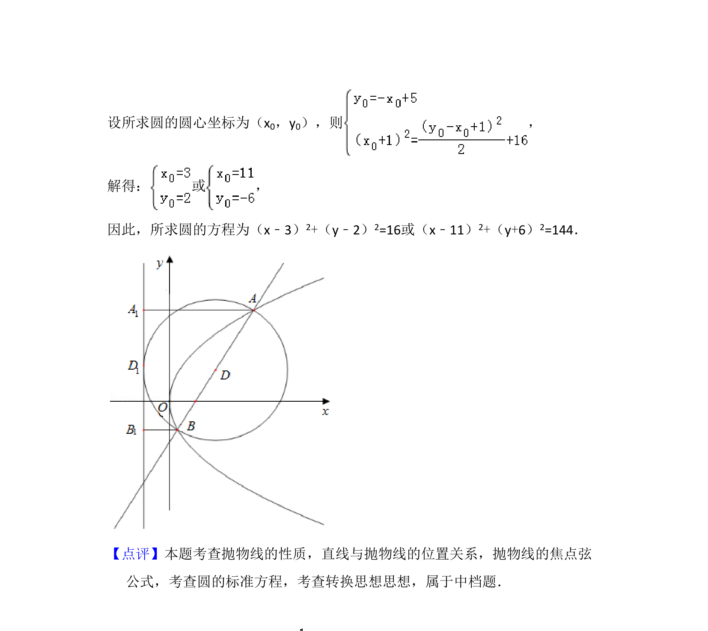

## 题面

## 摘要

考查抛物线与直线相交的焦点弦问题，并求过交点与准线相切的圆的方程。

## 关联考点

- [[1018-直线与抛物线的综合|直线与抛物线的综合]]
- [[380-抛物线焦点弦|焦点弦]]
- [[373-圆的标准方程|圆的标准方程]]
- [[878-抛物线的定义|抛物线的定义]]

## 答案与解析

> 📄 原 PDF 第 16 页：`素材/真题/吉林/2008-2024·（吉林）数学高考真题/2018年高考数学试卷（文）（新课标Ⅱ）（解析卷）.pdf`

<!-- 题干文本-start -->
## 题干文本
20．（12分）设抛物线C：y2=4x的焦点为F，过F且斜率为k（k＞0）的直线l与C
交于A，B两点，|AB|=8．
（1）求l的方程；
（2）求过点A，B且与C的准线相切的圆的方程．
<!-- 题干文本-end -->

<!-- 解析文本-start -->
## 解析文本
【考点】KN：直线与抛物线的综合．菁优网版权所有
【专题】35：转化思想；4R：转化法；5D：圆锥曲线的定义、性质与方程．
【分析】（1）方法一：设直线AB的方程，代入抛物线方程，根据抛物线的焦
点弦公式即可求得k的值，即可求得直线l的方程；
方法二：根据抛物线的焦点弦公式|AB|=，求得直线AB的倾斜角，即可
求得直线l的斜率，求得直线l的方程；
（2）根据过A，B分别向准线l作垂线，根据抛物线的定义即可求得半径，根据
中点坐标公式，即可求得圆心，求得圆的方程．
【解答】解：（1）方法一：抛物线C：y2=4x的焦点为F（1，0），
设直线AB的方程为：y=k（x﹣1），设A（x1，y1），B（x2，y2），
则 ，整理得：k 2x2﹣2（k2+2）x+k2=0，则x1+x2=，x 1x2=1，
由|AB|=x1+x2+p=+2=8，解得：k 2=1，则k=1，
∴直线l的方程y=x﹣1；
方法二：抛物线C：y2=4x的焦点为F（1，0），设直线AB的倾斜角为θ，由抛物
线的弦长公式|AB|= = =8，解得：sin 2θ=，
∴θ=，则直线的斜率k=1，
∴直线l的方程y=x﹣1；
（2）由（1）可得AB的中点坐标为D（3，2），则直线AB的垂直平分线方程为y
﹣2=﹣（x﹣3），即y=﹣x+5，
<!-- 解析文本-end -->
