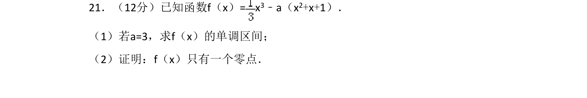
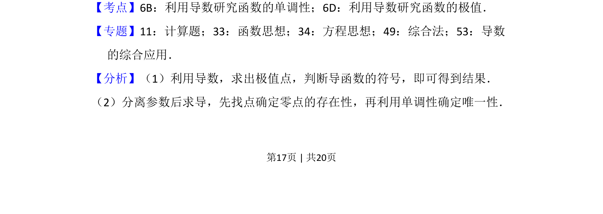

## 题面

## 摘要

本题通过导数研究含参函数的单调性，并利用零点存在定理及单调性证明零点唯一性。

## 关联考点

- [[利用导数研究函数的单调性]]
- [[利用导数研究函数的极值]]
- [[函数零点存在性定理]]

## 答案与解析

> 📄 原 PDF 第 17 页：`素材/真题/吉林/2008-2024·（吉林）数学高考真题/2018年高考数学试卷（文）（新课标Ⅱ）（解析卷）.pdf`
