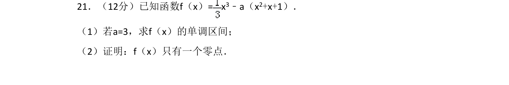
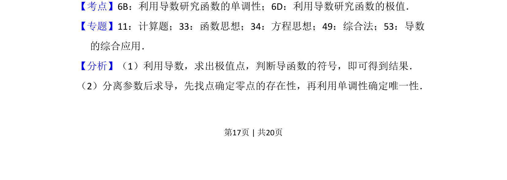
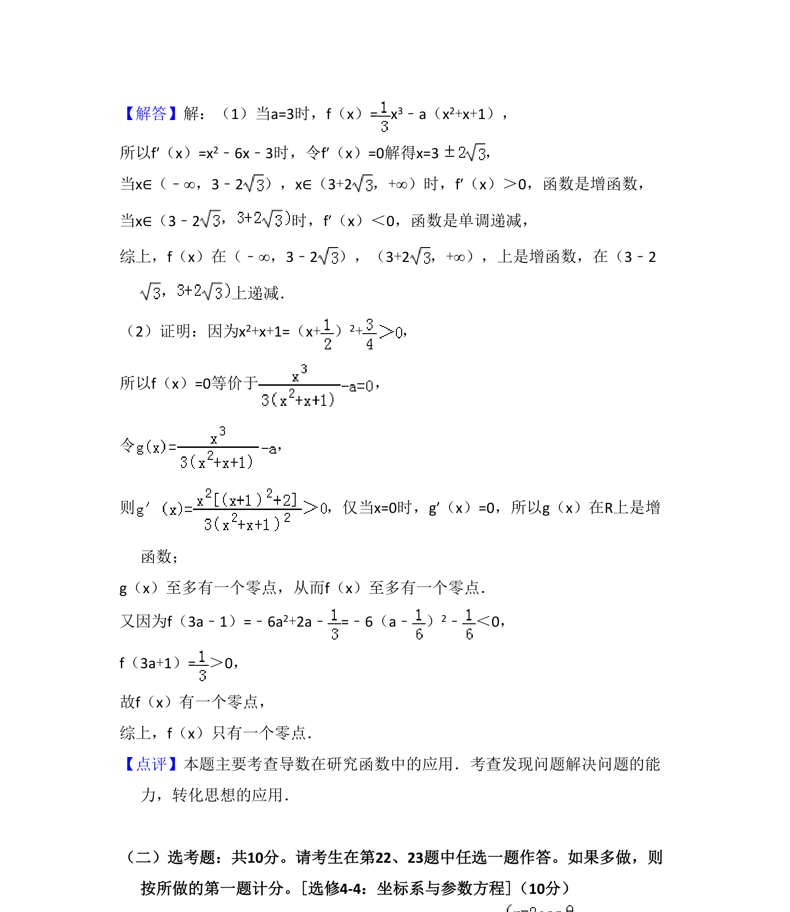

## 题面

## 摘要

本题通过导数研究含参函数的单调性，并利用零点存在定理及单调性证明零点唯一性。

## 关联考点

- [[705-利用导数研究函数的单调性|利用导数研究函数的单调性]]
- [[707-利用导数研究函数的极值|利用导数研究函数的极值]]
- [[694-函数零点存在性定理|函数零点存在性定理]]

## 答案与解析

> 📄 原 PDF 第 17 页：`素材/真题/吉林/2008-2024·（吉林）数学高考真题/2018年高考数学试卷（文）（新课标Ⅱ）（解析卷）.pdf`

<!-- 题干文本-start -->
## 题干文本
21．（12分）已知函数f（x）= x 3﹣a（x2+x+1）．
（1）若a=3，求f（x）的单调区间；
（2）证明：f（x）只有一个零点．
<!-- 题干文本-end -->

<!-- 解析文本-start -->
## 解析文本
【考点】6B：利用导数研究函数的单调性；6D：利用导数研究函数的极值．菁优网版权所有
【专题】11：计算题；33：函数思想；34：方程思想；49：综合法；53：导数
的综合应用．
【分析】（1）利用导数，求出极值点，判断导函数的符号，即可得到结果．
（2）分离参数后求导，先找点确定零点的存在性，再利用单调性确定唯一性．
<!-- 解析文本-end -->
