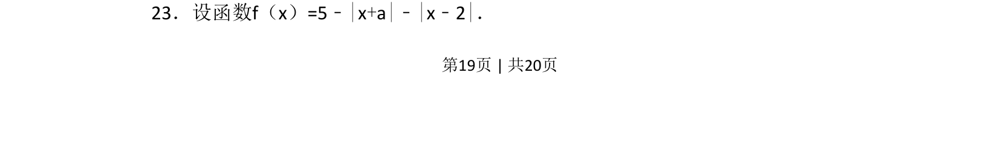
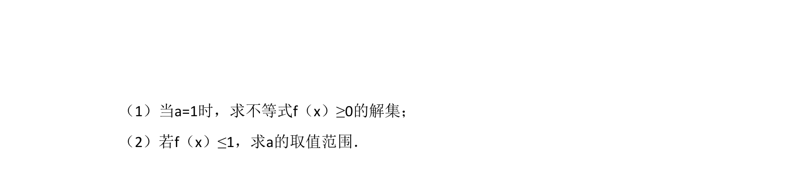
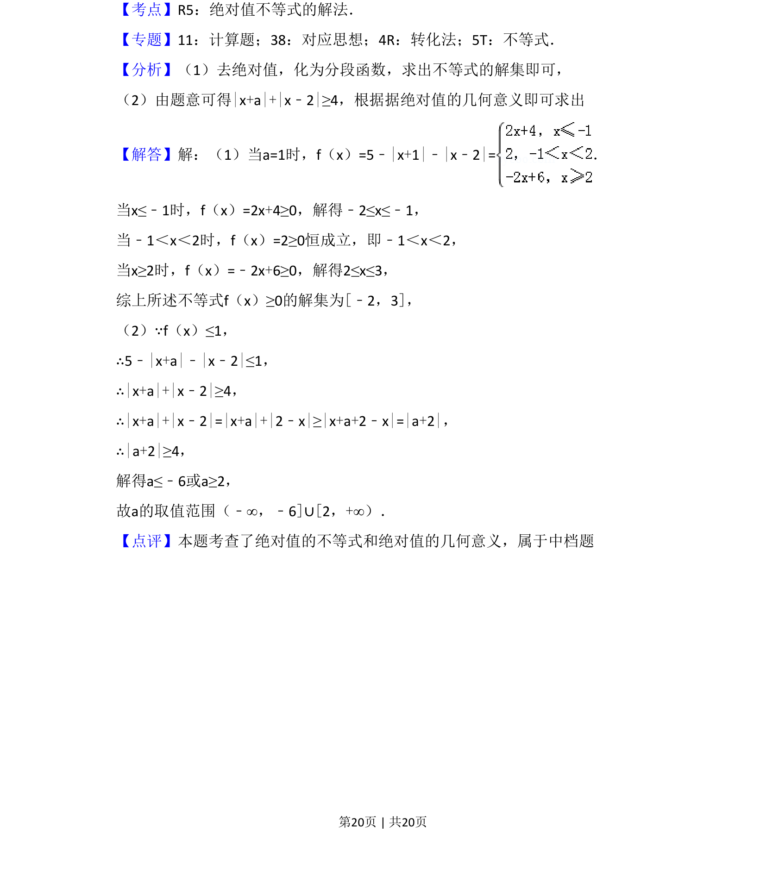

## 题面

## 摘要

该题考查含参数绝对值的函数综合问题，通常涉及不等式求解或参数范围讨论。

## 关联考点

- [[绝对值函数]]
- [[424-参数分类讨论|分类讨论]]
- [[参数范围]]
- [[083-不等式|不等式]]

## 答案与解析

> 📄 原 PDF 第 19 页：`素材/真题/吉林/2008-2024·（吉林）数学高考真题/2018年高考数学试卷（文）（新课标Ⅱ）（解析卷）.pdf`
