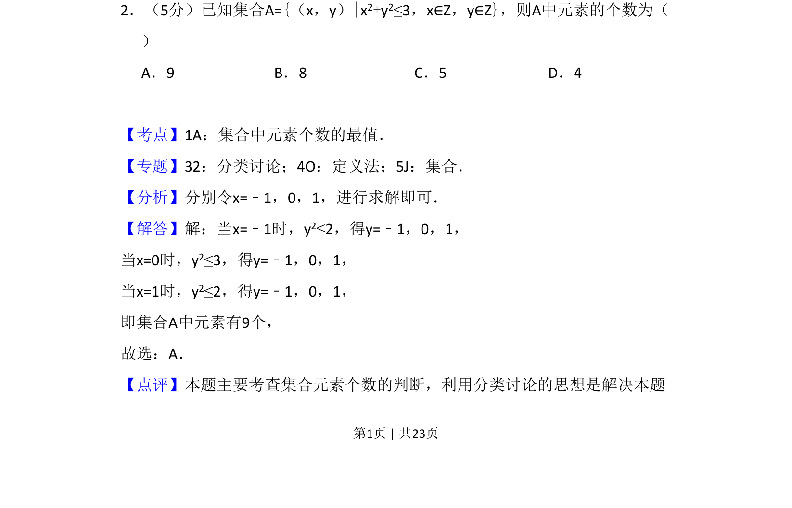
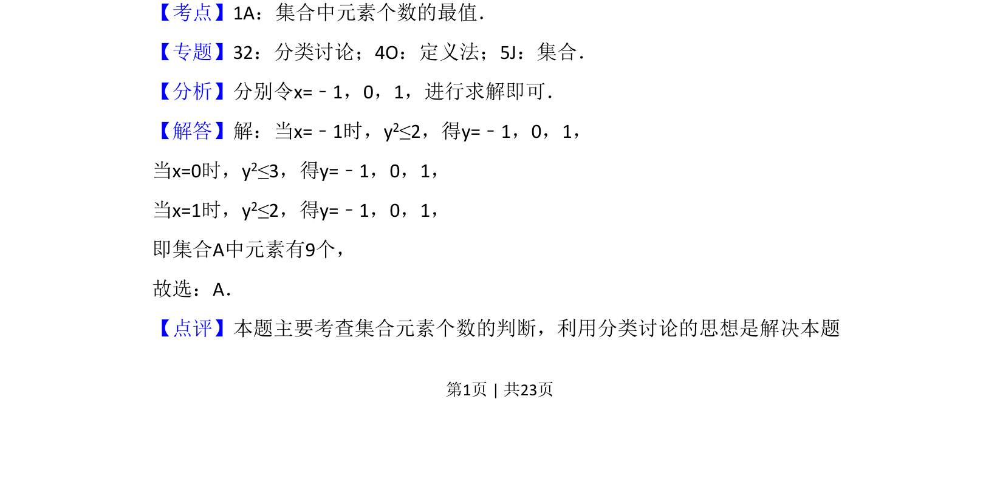
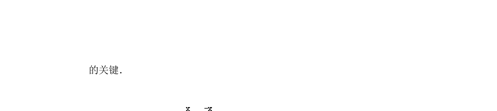

## 题面

## 摘要

集合中元素个数的判断，通过分类讨论确定圆内整点个数。

## 关联考点

- [[1136-集合元素个数|集合元素个数]]
- [[424-参数分类讨论|分类讨论]]
- [[623-不等式求解|不等式求解]]

## 答案与解析

> 📄 原 PDF 第 1 页：`素材/真题/吉林/2008-2024·（吉林）数学高考真题/2018年高考数学试卷（理）（新课标Ⅱ）（解析卷）.pdf`

<!-- 题干文本-start -->
## 题干文本
2．（5分）已知集合A={（x，y）|x2+y2≤3，x∈Z，y∈Z}，则A中元素的个数为（　　
）
A．9 B．8 C．5 D．4
<!-- 题干文本-end -->

<!-- 解析文本-start -->
## 解析文本
【考点】1A：集合中元素个数的最值．菁优网版权所有
【专题】32：分类讨论；4O：定义法；5J：集合．
【分析】分别令x=﹣1，0，1，进行求解即可．
【解答】解：当x=﹣1时，y2≤2，得y=﹣1，0，1，
当x=0时，y2≤3，得y=﹣1，0，1，
当x=1时，y2≤2，得y=﹣1，0，1，
即集合A中元素有9个，
故选：A．
【点评】本题主要考查集合元素个数的判断，利用分类讨论的思想是解决本题
<!-- 解析文本-end -->
