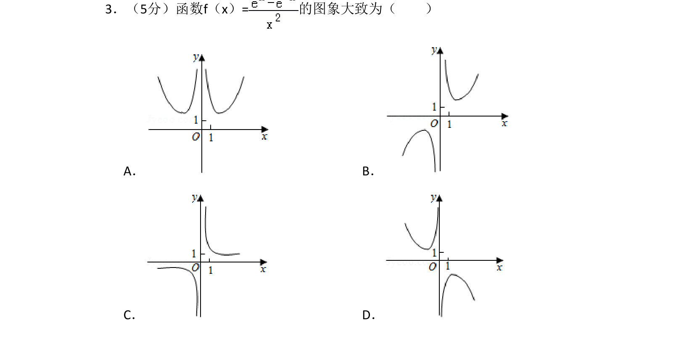
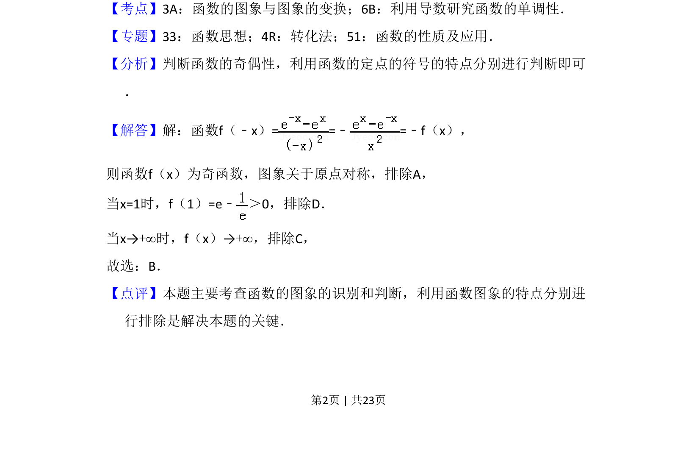

## 题面

## 摘要

本题考查函数图像的识别，通过奇偶性、特殊点函数值及极限排除错误选项。

## 关联考点

- [[689-函数的图象与图象的变换|函数的图象与图象的变换]]
- [[705-利用导数研究函数的单调性|利用导数研究函数的单调性]]
- [[284-函数的奇偶性|函数的奇偶性]]

## 答案与解析

> 📄 原 PDF 第 2 页：`素材/真题/吉林/2008-2024·（吉林）数学高考真题/2018年高考数学试卷（理）（新课标Ⅱ）（解析卷）.pdf`
