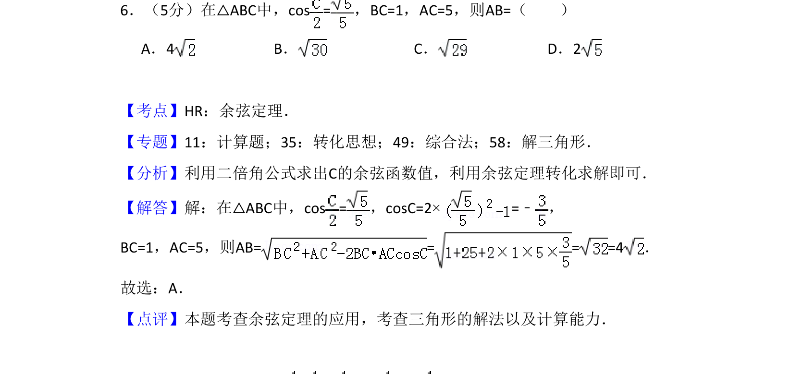
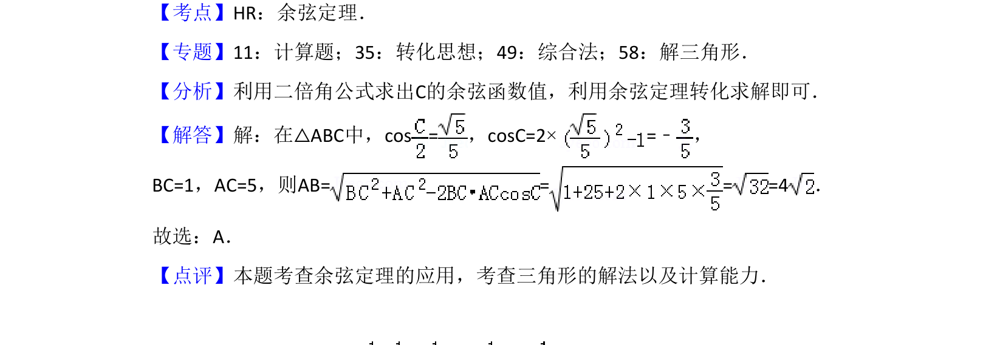

## 题面

## 摘要

本题考查三角形中利用二倍角公式求角，再运用余弦定理计算边长。

## 关联考点

- [[637-二倍角公式|二倍角公式]]
- [[126-定理|余弦定理]]

## 答案与解析

> 📄 原 PDF 第 4 页：`素材/真题/吉林/2008-2024·（吉林）数学高考真题/2018年高考数学试卷（理）（新课标Ⅱ）（解析卷）.pdf`

<!-- 题干文本-start -->
## 题干文本
6．（5分）在△ABC中，cos =，BC=1，AC=5，则AB=（　　）
A．4 B．C．D．2
<!-- 题干文本-end -->

<!-- 解析文本-start -->
## 解析文本
【考点】HR：余弦定理．菁优网版权所有
【专题】11：计算题；35：转化思想；49：综合法；58：解三角形．
【分析】利用二倍角公式求出C的余弦函数值，利用余弦定理转化求解即可．
【解答】解：在△ABC中，cos =，cosC=2×=﹣ ，
BC=1，AC=5，则AB= = = =4．
故选：A．
【点评】本题考查余弦定理的应用，考查三角形的解法以及计算能力．
<!-- 解析文本-end -->
