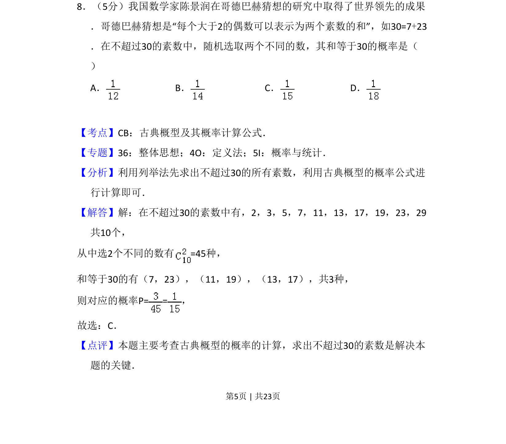
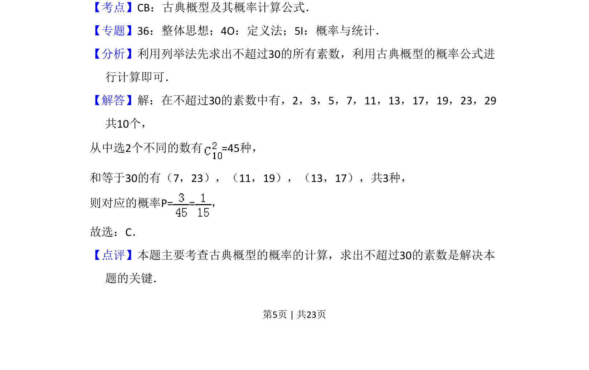

## 题面

## 摘要

本题以哥德巴赫猜想为背景，考查古典概型的概率计算，需列举素数求组合数。

## 关联考点

- [[320-古典概型|古典概型]]
- [[949-概率计算公式|概率计算公式]]
- [[703-列举法|列举法]]
- [[526-质数与合数|素数]]

## 答案与解析

> 📄 原 PDF 第 5 页：`素材/真题/吉林/2008-2024·（吉林）数学高考真题/2018年高考数学试卷（理）（新课标Ⅱ）（解析卷）.pdf`
