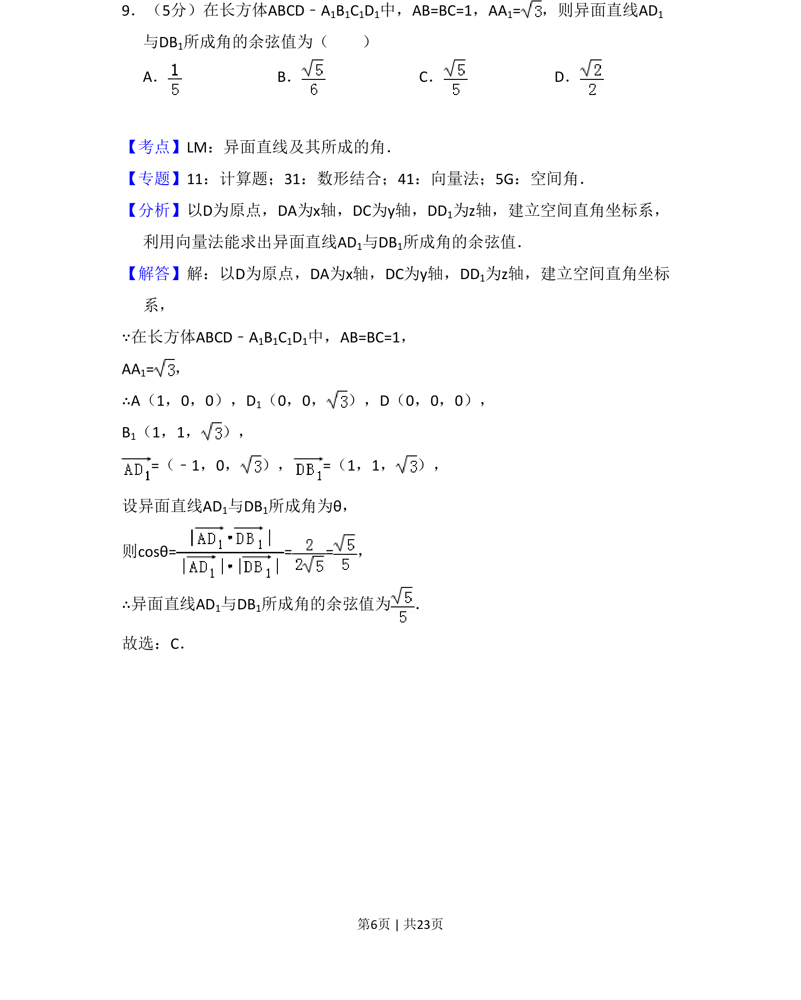
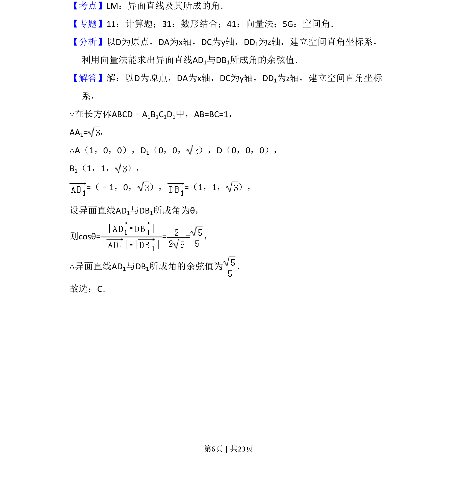
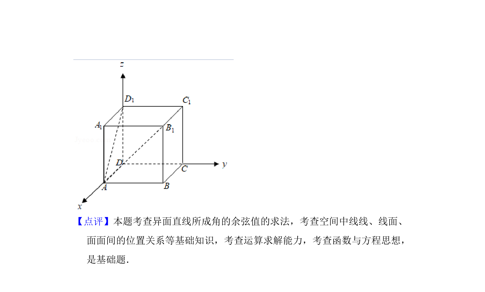

## 题面

## 摘要

长方体中以向量法求异面直线AD1与DB1所成角的余弦值。

## 关联考点

- [[862-异面直线及其所成的角|异面直线及其所成的角]]
- [[753-向量法|向量法]]
- [[399-空间向量坐标表示|空间直角坐标系]]

## 答案与解析

> 📄 原 PDF 第 6 页：`素材/真题/吉林/2008-2024·（吉林）数学高考真题/2018年高考数学试卷（理）（新课标Ⅱ）（解析卷）.pdf`

<!-- 题干文本-start -->
## 题干文本
9．（5分）在长方体ABCD﹣A1B1C1D1中，AB=BC=1，AA1=，则异面直线AD 1
与DB1所成角的余弦值为（　　）
A．B．C．D．
<!-- 题干文本-end -->

<!-- 解析文本-start -->
## 解析文本
【考点】LM：异面直线及其所成的角．菁优网版权所有
【专题】11：计算题；31：数形结合；41：向量法；5G：空间角．
【分析】以D为原点，DA为x轴，DC为y轴，DD1为z轴，建立空间直角坐标系，
利用向量法能求出异面直线AD1与DB1所成角的余弦值．
【解答】解：以D为原点，DA为x轴，DC为y轴，DD1为z轴，建立空间直角坐标
系，
∵在长方体ABCD﹣A1B1C1D1中，AB=BC=1，
AA1=，
∴A（1，0，0），D1（0，0， ），D（0，0，0），
B1（1，1， ），
=（﹣1，0， ），=（1，1， ），
设异面直线AD1与DB1所成角为θ，
则cosθ== =，
∴异面直线AD1与DB1所成角的余弦值为 ．
故选：C．
<!-- 解析文本-end -->
