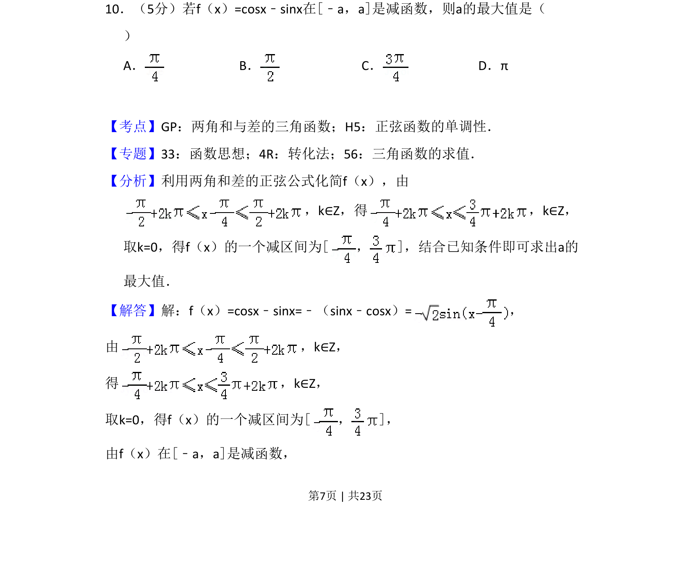
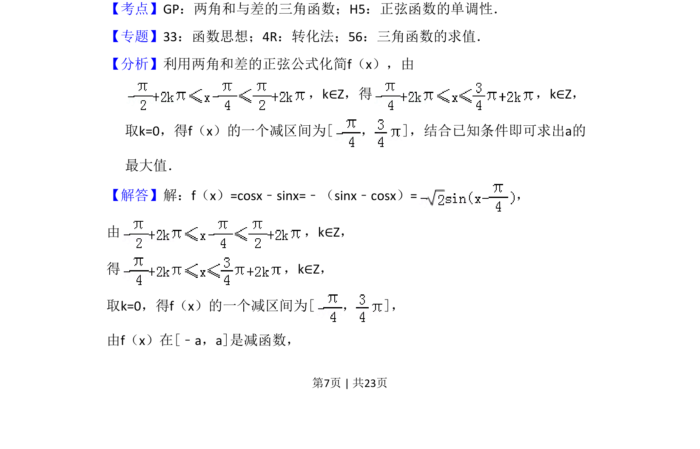
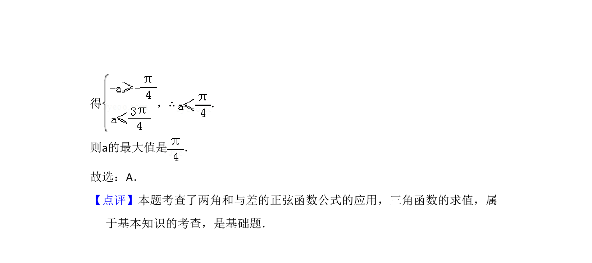

## 题面

## 摘要

利用正弦函数单调性求参数最大值，通过三角恒等变换化简函数解析式。

## 关联考点

- [[628-两角和与差的三角函数|两角和与差的三角函数]]
- [[961-正弦函数的单调性|正弦函数的单调性]]

## 答案与解析

> 📄 原 PDF 第 7 页：`素材/真题/吉林/2008-2024·（吉林）数学高考真题/2018年高考数学试卷（理）（新课标Ⅱ）（解析卷）.pdf`

<!-- 题干文本-start -->
## 题干文本
10．（5分）若f（x）=cosx﹣sinx在[﹣a，a]是减函数，则a的最大值是（　　
）
A．B．C．D．π
<!-- 题干文本-end -->

<!-- 解析文本-start -->
## 解析文本
【考点】GP：两角和与差的三角函数；H5：正弦函数的单调性．菁优网版权所有
【专题】33：函数思想；4R：转化法；56：三角函数的求值．
【分析】利用两角和差的正弦公式化简f（x），由
，k∈Z，得 ，k∈Z，
取k=0，得f（x）的一个减区间为[，]，结合已知条件即可求出a的
最大值．
【解答】解：f（x）=cosx﹣sinx=﹣（sinx﹣cosx）=，
由 ，k∈Z，
得 ，k∈Z，
取k=0，得f（x）的一个减区间为[，]，
由f（x）在[﹣a，a]是减函数，
<!-- 解析文本-end -->
