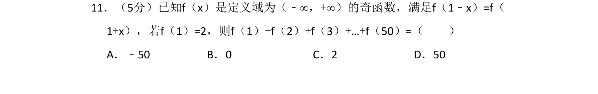
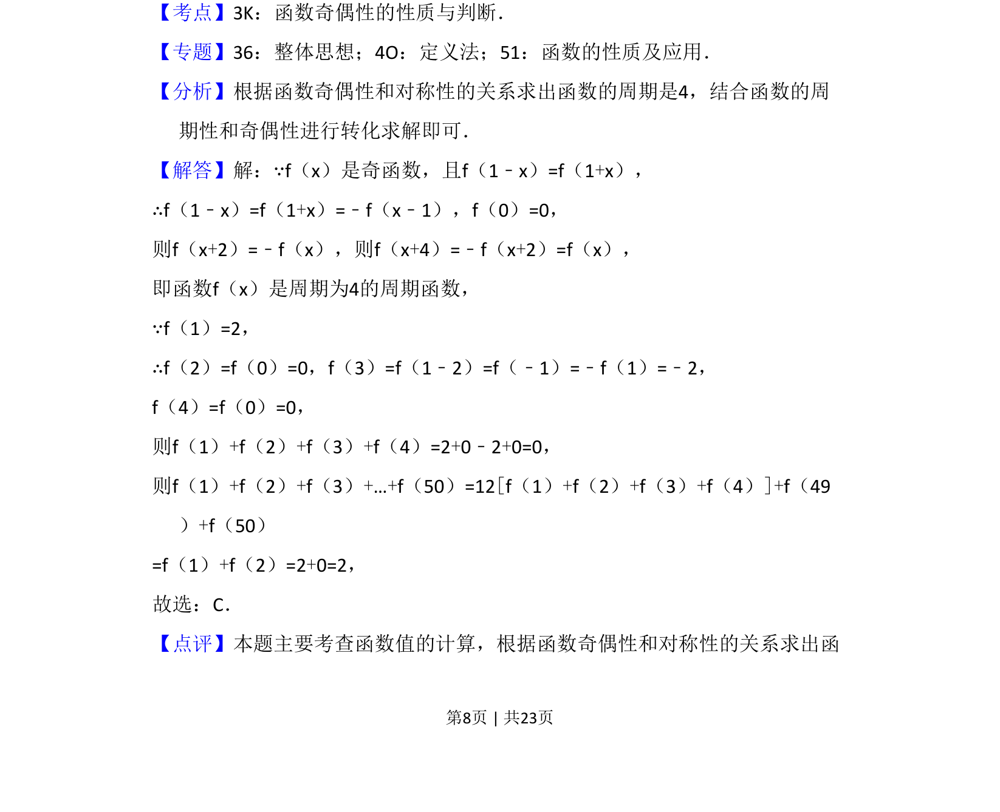

## 题面

## 摘要

根据奇函数性质和对称轴推导周期，利用周期性和赋值求和。

## 关联考点

- [[817-奇偶性|奇偶性]]
- [[761-周期性|周期性]]
- [[681-函数对称性|函数对称性]]
- [[1116-赋值|赋值法]]

## 答案与解析

> 📄 原 PDF 第 8 页：`素材/真题/吉林/2008-2024·（吉林）数学高考真题/2018年高考数学试卷（理）（新课标Ⅱ）（解析卷）.pdf`

<!-- 题干文本-start -->
## 题干文本
11．（5分）已知f（x）是定义域为（﹣∞，+∞）的奇函数，满足f（1﹣x）=f（
1+x），若f（1）=2，则f（1）+f（2）+f（3）+…+f（50）=（　　）
A．﹣50 B．0 C．2 D．50
<!-- 题干文本-end -->

<!-- 解析文本-start -->
## 解析文本
【考点】3K：函数奇偶性的性质与判断．菁优网版权所有
【专题】36：整体思想；4O：定义法；51：函数的性质及应用．
【分析】根据函数奇偶性和对称性的关系求出函数的周期是4，结合函数的周
期性和奇偶性进行转化求解即可．
【解答】解：∵f（x）是奇函数，且f（1﹣x）=f（1+x），
∴f（1﹣x）=f（1+x）=﹣f（x﹣1），f（0）=0，
则f（x+2）=﹣f（x），则f（x+4）=﹣f（x+2）=f（x），
即函数f（x）是周期为4的周期函数，
∵f（1）=2，
∴f（2）=f（0）=0，f（3）=f（1﹣2）=f（﹣1）=﹣f（1）=﹣2，
f（4）=f（0）=0，
则f（1）+f（2）+f（3）+f（4）=2+0﹣2+0=0，
则f（1）+f（2）+f（3）+…+f（50）=12[f（1）+f（2）+f（3）+f（4）]+f（49
）+f（50）
=f（1）+f（2）=2+0=2，
故选：C．
【点评】本题主要考查函数值的计算，根据函数奇偶性和对称性的关系求出函
<!-- 解析文本-end -->
