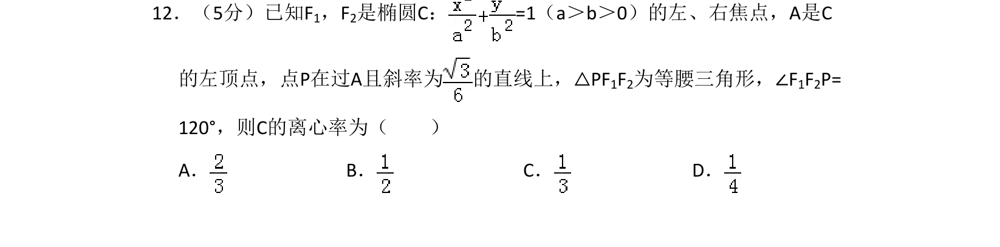
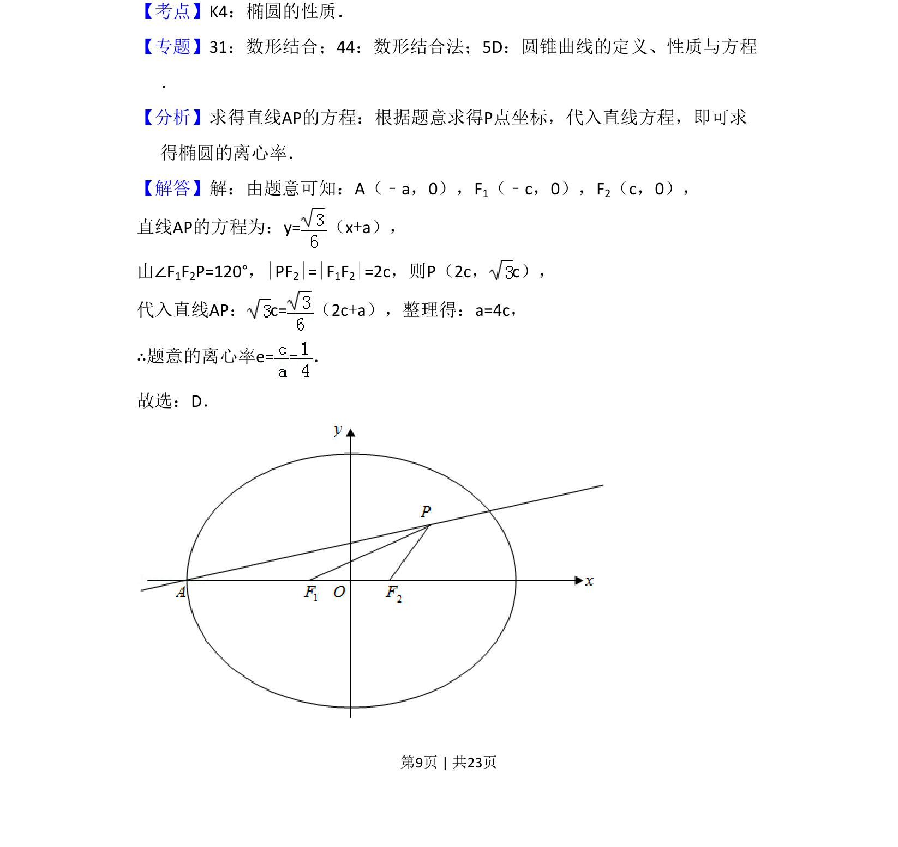

## 题面

## 摘要

通过椭圆焦点、顶点及等腰三角形条件建立方程求离心率。

## 关联考点

- [[388-椭圆几何性质|椭圆性质]]
- [[391-椭圆离心率|离心率]]
- [[直线方程]]
- [[数形结合]]

## 答案与解析

> 📄 原 PDF 第 9 页：`素材/真题/吉林/2008-2024·（吉林）数学高考真题/2018年高考数学试卷（理）（新课标Ⅱ）（解析卷）.pdf`
