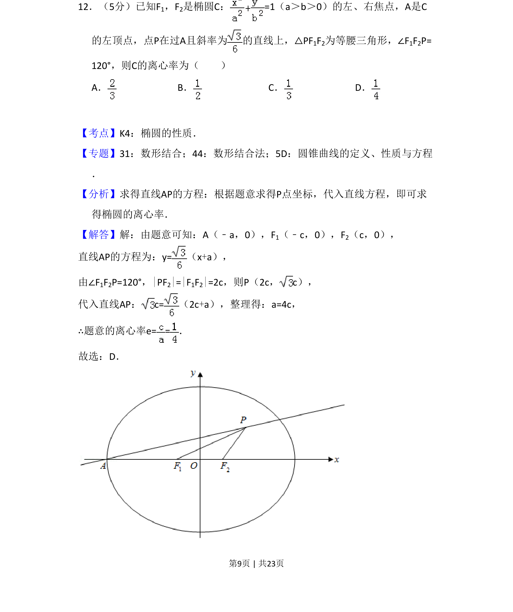
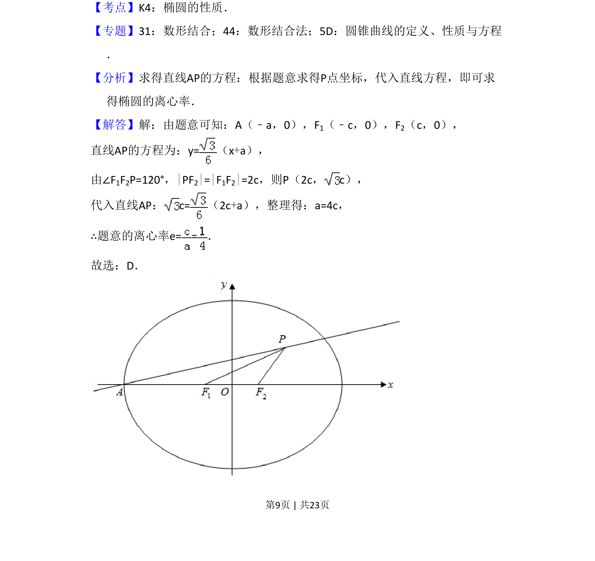
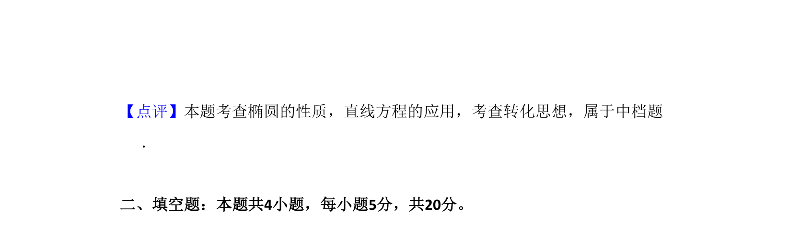

## 题面

## 摘要

通过椭圆焦点、顶点及等腰三角形条件建立方程求离心率。

## 关联考点

- [[388-椭圆几何性质|椭圆性质]]
- [[391-椭圆离心率|离心率]]
- [[1026-直线方程|直线方程]]
- [[897-数形结合|数形结合]]

## 答案与解析

> 📄 原 PDF 第 9 页：`素材/真题/吉林/2008-2024·（吉林）数学高考真题/2018年高考数学试卷（理）（新课标Ⅱ）（解析卷）.pdf`

<!-- 题干文本-start -->
## 题干文本
12．（5分）已知F1，F2是椭圆C：=1（a＞b＞0）的左、右焦点，A是C
的左顶点，点P在过A且斜率为 的直线上，△PF 1F2为等腰三角形，∠F1F2P=
120°，则C的离心率为（　　）
A．B．C．D．
<!-- 题干文本-end -->

<!-- 解析文本-start -->
## 解析文本
【考点】K4：椭圆的性质．菁优网版权所有
【专题】31：数形结合；44：数形结合法；5D：圆锥曲线的定义、性质与方程
．
【分析】求得直线AP的方程：根据题意求得P点坐标，代入直线方程，即可求
得椭圆的离心率．
【解答】解：由题意可知：A（﹣a，0），F1（﹣c，0），F2（c，0），
直线AP的方程为：y=（x+a），
由∠F1F2P=120°，|PF2|=|F1F2|=2c，则P（2c，c），
代入直线AP：c=（2c+a），整理得：a=4c，
∴题意的离心率e= =．
故选：D．
<!-- 解析文本-end -->
