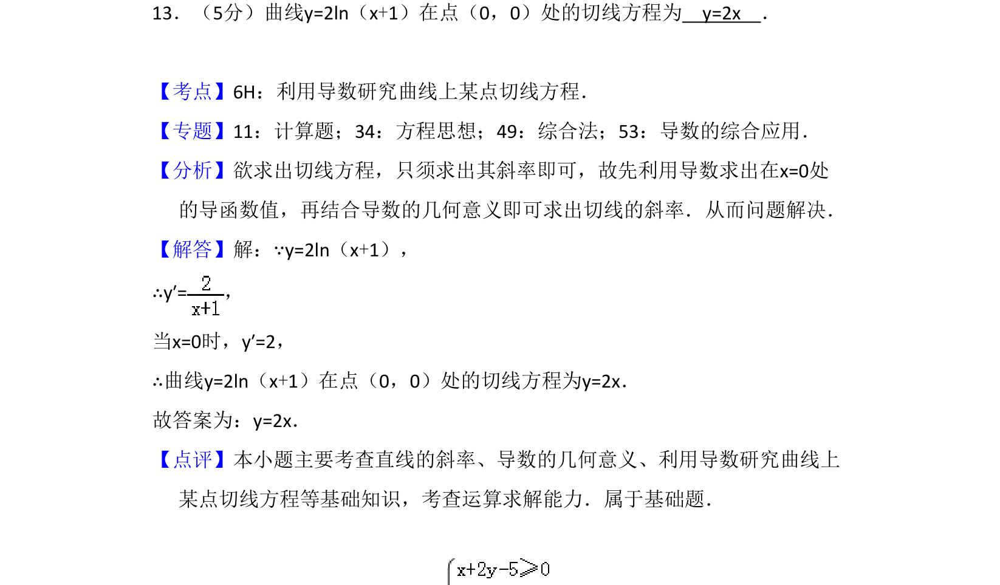
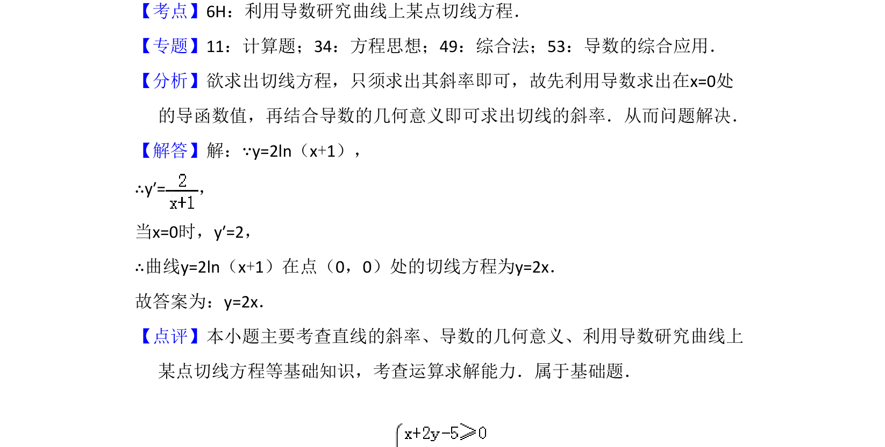

## 题面

## 摘要

利用导数求曲线在某点处的切线方程

## 关联考点

- [[440-导数的几何意义|导数几何意义]]
- [[422-切线方程|切线方程]]
- [[835-导函数值计算|导函数值计算]]

## 答案与解析

> 📄 原 PDF 第 10 页：`素材/真题/吉林/2008-2024·（吉林）数学高考真题/2018年高考数学试卷（理）（新课标Ⅱ）（解析卷）.pdf`

<!-- 题干文本-start -->
## 题干文本
13．（5分）曲线y=2ln（x+1）在点（0，0）处的切线方程为　y=2x　．
<!-- 题干文本-end -->

<!-- 解析文本-start -->
## 解析文本
【考点】6H：利用导数研究曲线上某点切线方程．菁优网版权所有
【专题】11：计算题；34：方程思想；49：综合法；53：导数的综合应用．
【分析】欲求出切线方程，只须求出其斜率即可，故先利用导数求出在x=0处
的导函数值，再结合导数的几何意义即可求出切线的斜率．从而问题解决．
【解答】解：∵y=2ln（x+1），
∴y′=，
当x=0时，y′=2，
∴曲线y=2ln（x+1）在点（0，0）处的切线方程为y=2x．
故答案为：y=2x．
【点评】本小题主要考查直线的斜率、导数的几何意义、利用导数研究曲线上
某点切线方程等基础知识，考查运算求解能力．属于基础题．
<!-- 解析文本-end -->
