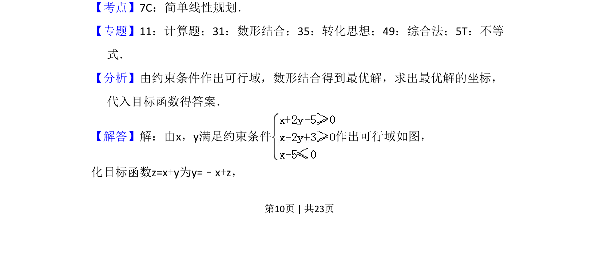
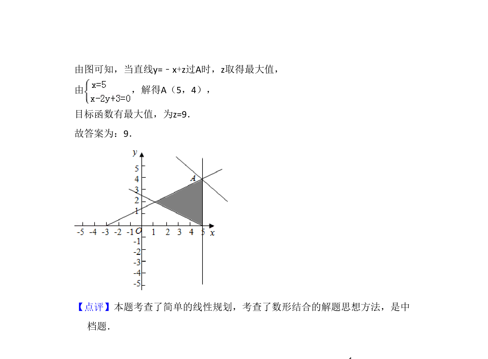

## 题面

## 摘要

考查简单线性规划中利用可行域求线性目标函数最大值的问题。

## 关联考点

- [[1074-简单线性规划|简单线性规划]]
- [[897-数形结合|数形结合]]
- [[1000-目标函数最值|目标函数最值]]

## 答案与解析

> 📄 原 PDF 第 10 页：`素材/真题/吉林/2008-2024·（吉林）数学高考真题/2018年高考数学试卷（理）（新课标Ⅱ）（解析卷）.pdf`

<!-- 题干文本-start -->
## 题干文本
14．（5分）若x，y满足约束条件 ，则z=x+y的最大值为　9　．
<!-- 题干文本-end -->

<!-- 解析文本-start -->
## 解析文本
【考点】7C：简单线性规划．菁优网版权所有
【专题】11：计算题；31：数形结合；35：转化思想；49：综合法；5T：不等
式．
【分析】由约束条件作出可行域，数形结合得到最优解，求出最优解的坐标，
代入目标函数得答案．
【解答】解：由x，y满足约束条件 作出可行域如图，
化目标函数z=x+y为y=﹣x+z，
<!-- 解析文本-end -->
