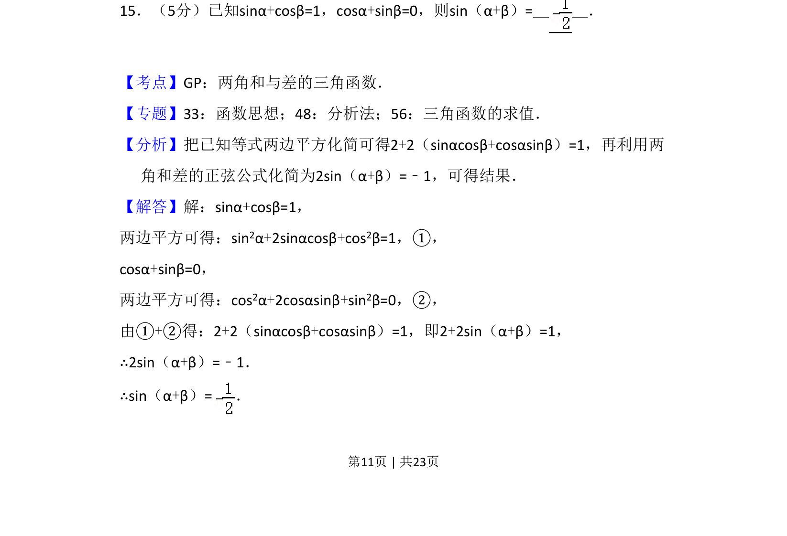
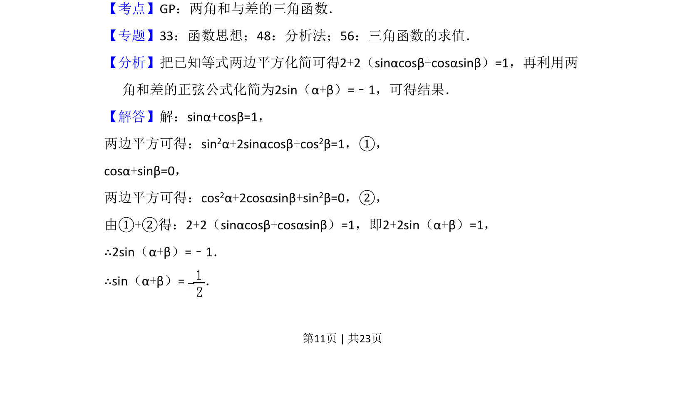
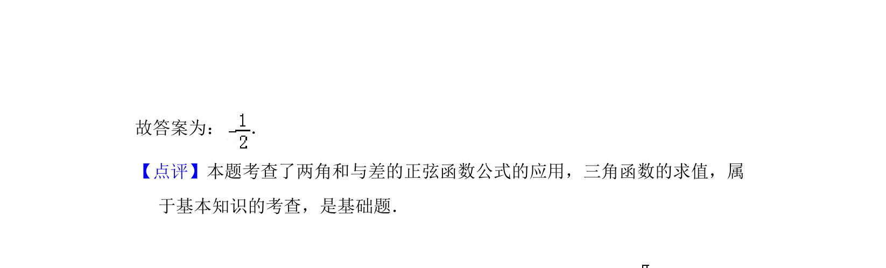

## 题面

## 摘要

已知两个三角函数方程，两边平方后相加，利用公式求得 sin(α+β) 的值。

## 关联考点

- [[634-两角和的正弦公式|两角和的正弦公式]]
- [[845-平方运算|平方运算]]
- [[610-三角函数求值|三角函数求值]]

## 答案与解析

> 📄 原 PDF 第 11 页：`素材/真题/吉林/2008-2024·（吉林）数学高考真题/2018年高考数学试卷（理）（新课标Ⅱ）（解析卷）.pdf`
