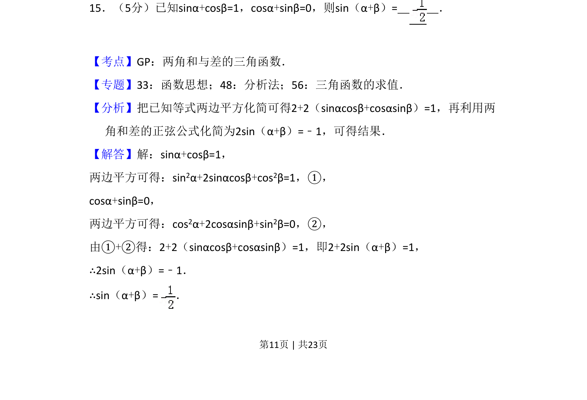
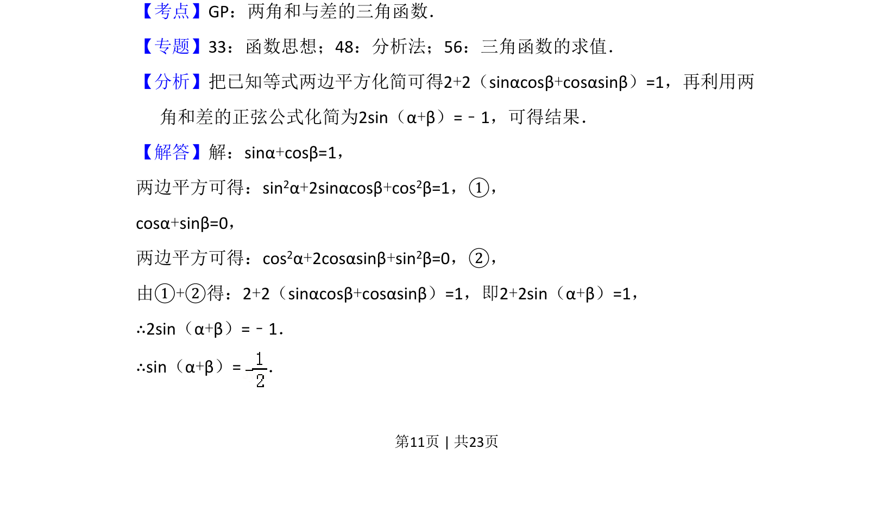
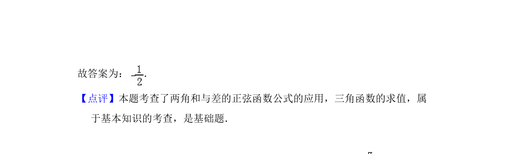

## 题面

## 摘要

已知两个三角函数方程，两边平方后相加，利用公式求得 sin(α+β) 的值。

## 关联考点

- [[634-两角和的正弦公式|两角和的正弦公式]]
- [[845-平方运算|平方运算]]
- [[610-三角函数求值|三角函数求值]]

## 答案与解析

> 📄 原 PDF 第 11 页：`素材/真题/吉林/2008-2024·（吉林）数学高考真题/2018年高考数学试卷（理）（新课标Ⅱ）（解析卷）.pdf`

<!-- 题干文本-start -->
## 题干文本
15．（5分）已知sinα+cosβ=1，cosα+sinβ=0，则sin（α+β）=　 　．
<!-- 题干文本-end -->

<!-- 解析文本-start -->
## 解析文本
【考点】GP：两角和与差的三角函数．菁优网版权所有
【专题】33：函数思想；48：分析法；56：三角函数的求值．
【分析】把已知等式两边平方化简可得2+2（sinαcosβ+cosαsinβ）=1，再利用两
角和差的正弦公式化简为2sin（α+β）=﹣1，可得结果．
【解答】解：sinα+cosβ=1，
两边平方可得：sin2α+2sinαcosβ+cos2β=1，①，
cosα+sinβ=0，
两边平方可得：cos2α+2cosαsinβ+sin2β=0，②，
由①+②得：2+2（sinαcosβ+cosαsinβ）=1，即2+2sin（α+β）=1，
∴2sin（α+β）=﹣1．
∴sin（α+β）=．
<!-- 解析文本-end -->
