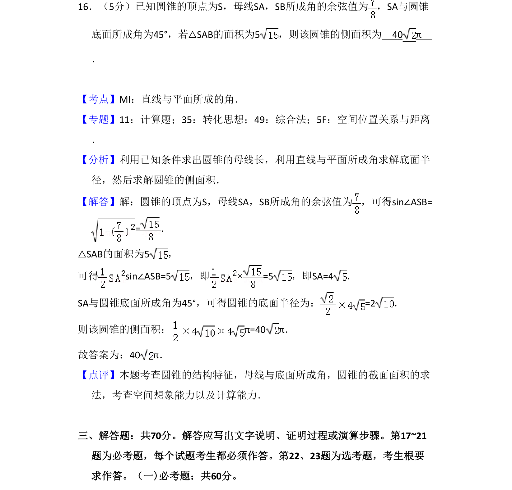
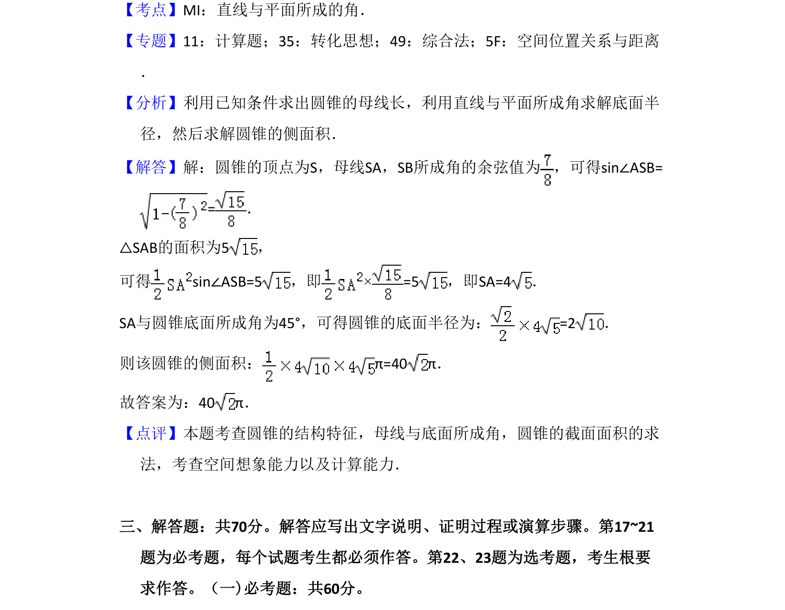

## 题面

## 摘要

圆锥的侧面积计算，涉及母线夹角余弦值、线面角及截面面积条件求母线长和底面半径。

## 关联考点

- [[783-圆锥侧面积|圆锥侧面积]]
- [[1013-直线与平面所成的角|直线与平面所成角]]
- [[589-解三角形|解三角形]]
- [[1049-空间几何计算|空间几何计算]]

## 答案与解析

> 📄 原 PDF 第 12 页：`素材/真题/吉林/2008-2024·（吉林）数学高考真题/2018年高考数学试卷（理）（新课标Ⅱ）（解析卷）.pdf`

<!-- 题干文本-start -->
## 题干文本
16．（5分）已知圆锥的顶点为S，母线SA，SB所成角的余弦值为 ，SA与圆锥
底面所成角为45°，若△SAB的面积为5，则该圆锥的侧面积为　40 π　
．
<!-- 题干文本-end -->

<!-- 解析文本-start -->
## 解析文本
【考点】MI：直线与平面所成的角．菁优网版权所有
【专题】11：计算题；35：转化思想；49：综合法；5F：空间位置关系与距离
．
【分析】利用已知条件求出圆锥的母线长，利用直线与平面所成角求解底面半
径，然后求解圆锥的侧面积．
【解答】解：圆锥的顶点为S，母线SA，SB所成角的余弦值为 ，可得sin∠ASB=
=．
△SAB的面积为5，
可得sin∠ASB=5，即×=5，即SA=4．
SA与圆锥底面所成角为45°，可得圆锥的底面半径为：=2．
则该圆锥的侧面积：π=40 π．
故答案为：40π．
【点评】本题考查圆锥的结构特征，母线与底面所成角，圆锥的截面面积的求
法，考查空间想象能力以及计算能力．
　
三、解答题：共70分。解答应写出文字说明、证明过程或演算步骤。第17~21
题为必考题，每个试题考生都必须作答。第22、23题为选考题，考生根要
求作答。（一)必考题：共60分。
<!-- 解析文本-end -->
