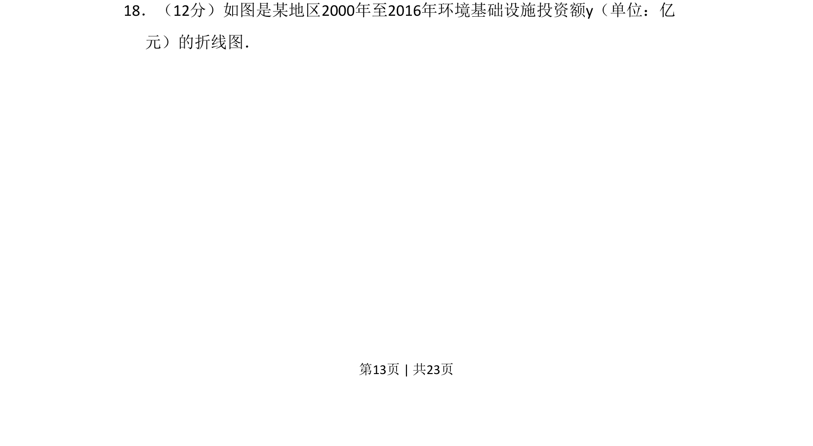
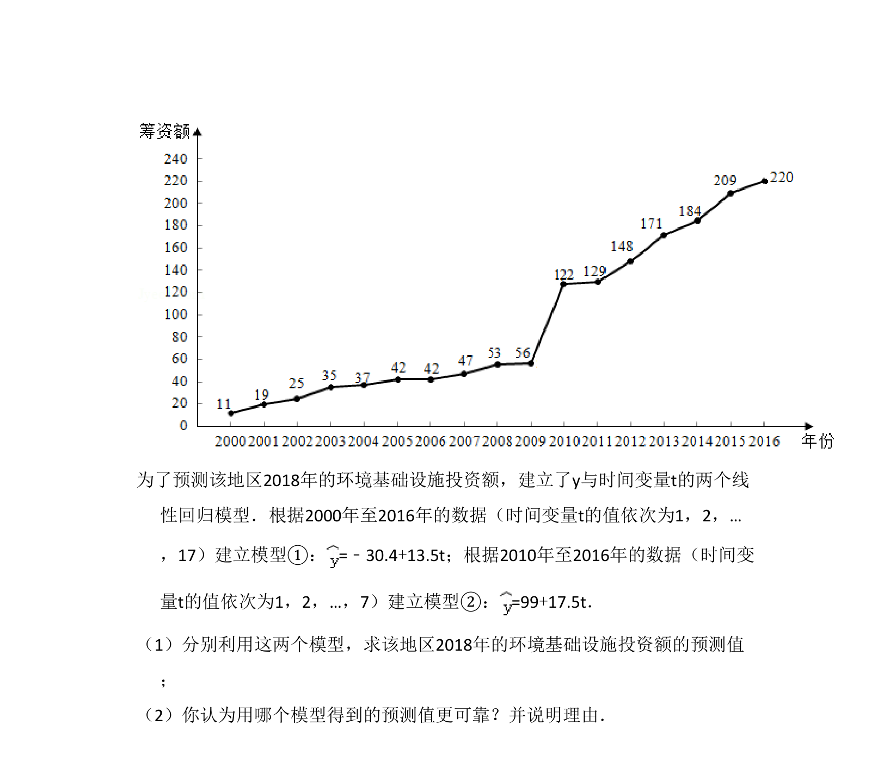
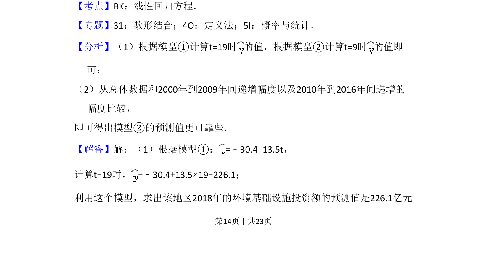
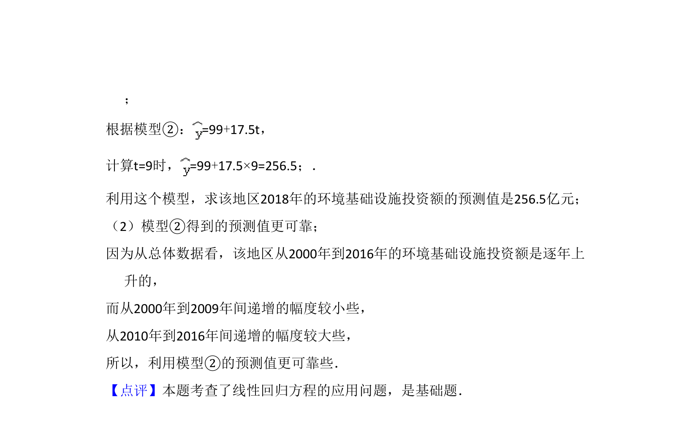

## 题面

## 摘要

根据折线图分析环境基础设施投资额的变化趋势，建立回归模型并预测。

## 关联考点

- [[481-回归直线方程|线性回归方程]]
- [[068-折线统计图|折线图]]
- [[1207-数据统计|数据统计]]

## 答案与解析

> 📄 原 PDF 第 13 页：`素材/真题/吉林/2008-2024·（吉林）数学高考真题/2018年高考数学试卷（理）（新课标Ⅱ）（解析卷）.pdf`
