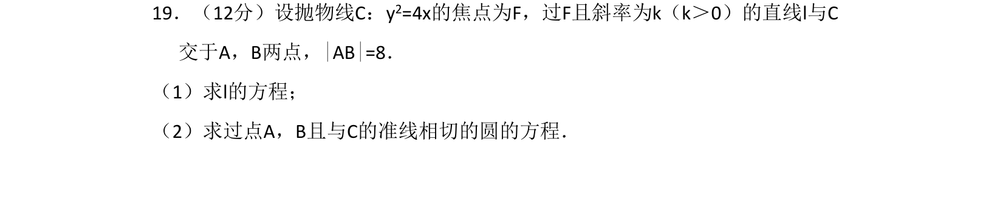
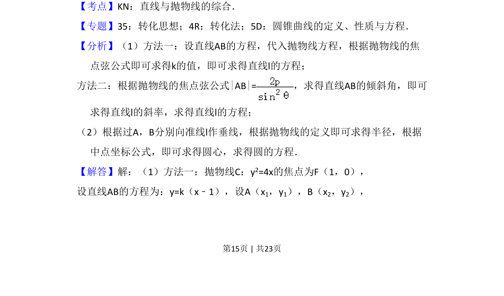
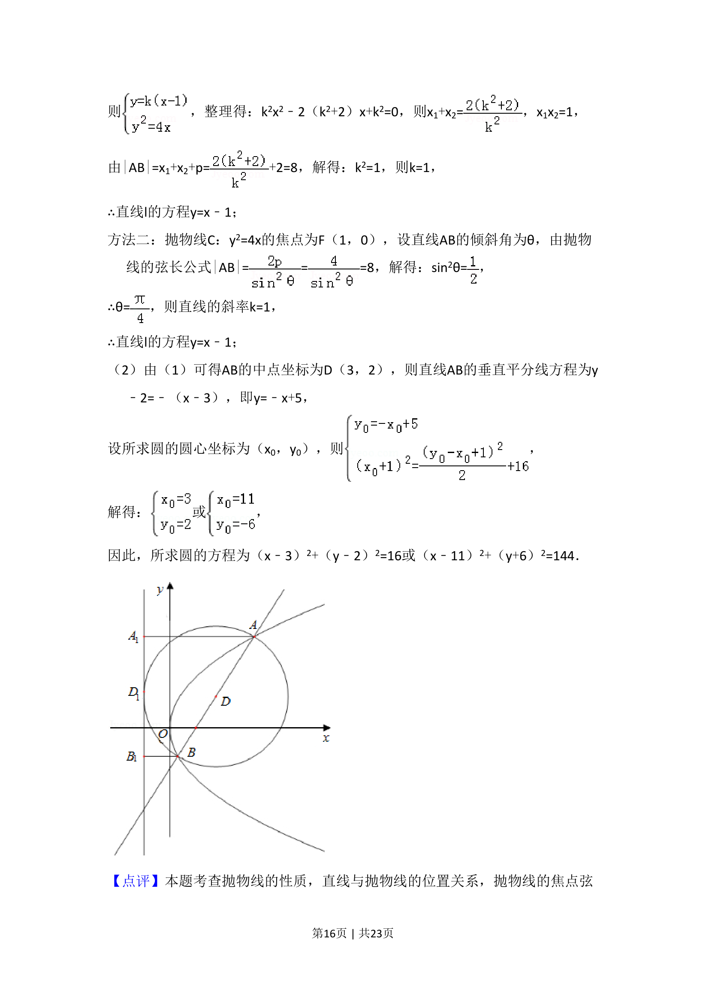

## 题面

## 摘要

求抛物线焦点弦所在直线方程及与准线相切的圆方程

## 关联考点

- [[1018-直线与抛物线的综合|直线与抛物线的综合]]
- [[380-抛物线焦点弦|焦点弦]]
- [[782-圆的方程|圆的方程]]
- [[878-抛物线的定义|抛物线的定义]]

## 答案与解析

> 📄 原 PDF 第 15 页：`素材/真题/吉林/2008-2024·（吉林）数学高考真题/2018年高考数学试卷（理）（新课标Ⅱ）（解析卷）.pdf`
