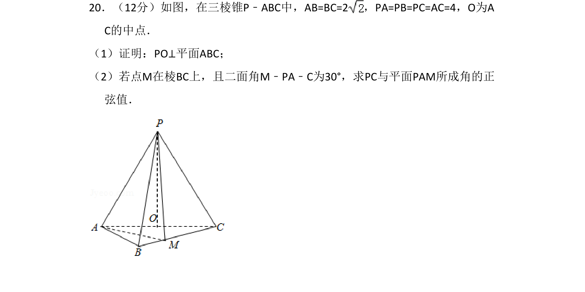
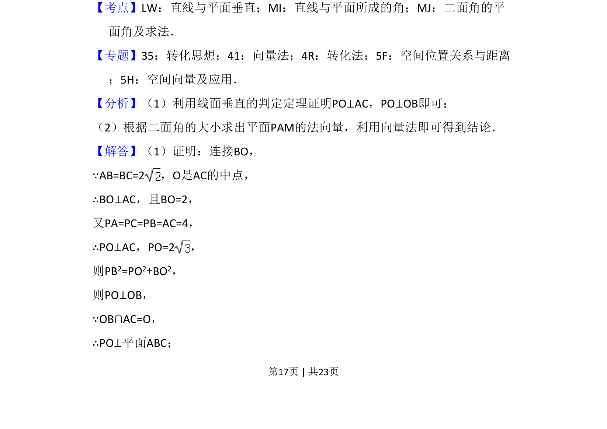
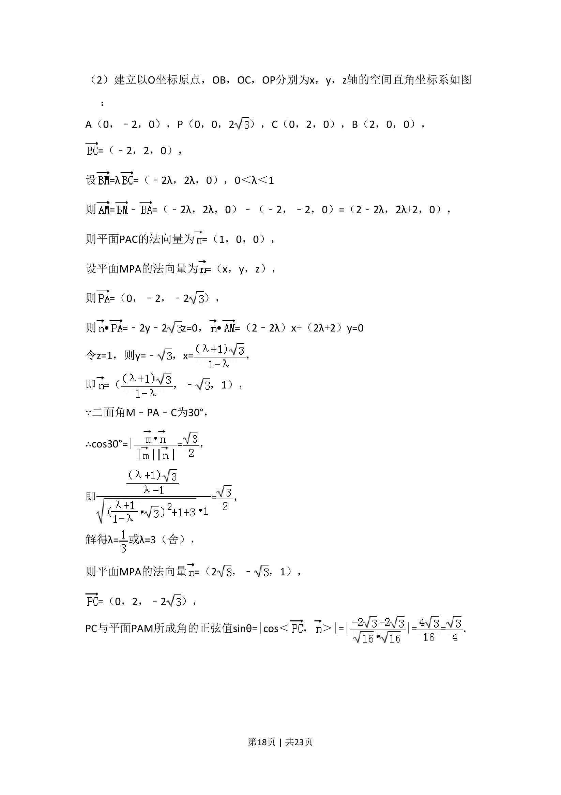
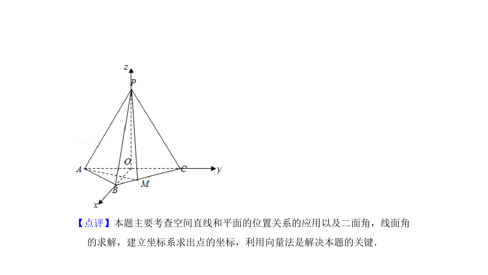

## 题面

## 摘要

本题考查三棱锥中证明线面垂直及利用二面角条件求线面角的正弦值。

## 关联考点

- [[1010-直线与平面垂直|直线与平面垂直]]
- [[1013-直线与平面所成的角|直线与平面所成的角]]
- [[643-二面角的平面角及求法|二面角的平面角及求法]]

## 答案与解析

> 📄 原 PDF 第 17 页：`素材/真题/吉林/2008-2024·（吉林）数学高考真题/2018年高考数学试卷（理）（新课标Ⅱ）（解析卷）.pdf`

<!-- 题干文本-start -->
## 题干文本
20．（12分）如图，在三棱锥P﹣ABC中，AB=BC=2，PA=PB=PC=AC=4，O为A
C的中点．
（1）证明：PO⊥平面ABC；
（2）若点M在棱BC上，且二面角M﹣PA﹣C为30°，求PC与平面PAM所成角的正
弦值．
<!-- 题干文本-end -->

<!-- 解析文本-start -->
## 解析文本
【考点】LW：直线与平面垂直；MI：直线与平面所成的角；MJ：二面角的平
面角及求法．菁优网版权所有
【专题】35：转化思想；41：向量法；4R：转化法；5F：空间位置关系与距离
；5H：空间向量及应用．
【分析】（1）利用线面垂直的判定定理证明PO⊥AC，PO⊥OB即可；
（2）根据二面角的大小求出平面PAM的法向量，利用向量法即可得到结论．
【解答】（1）证明：连接BO，
∵AB=BC=2，O是AC的中点，
∴BO⊥AC，且BO=2，
又PA=PC=PB=AC=4，
∴PO⊥AC，PO=2，
则PB2=PO2+BO2，
则PO⊥OB，
∵OB∩AC=O，
∴PO⊥平面ABC；
<!-- 解析文本-end -->
