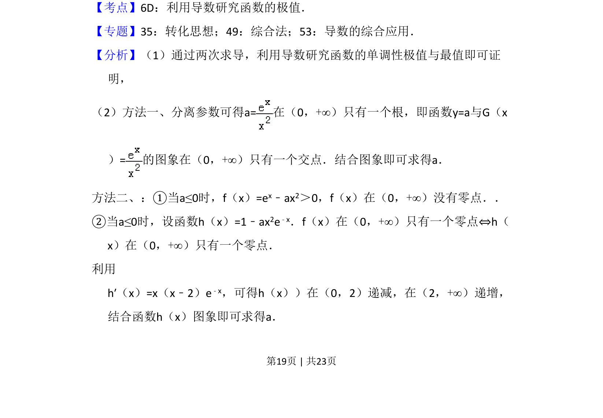
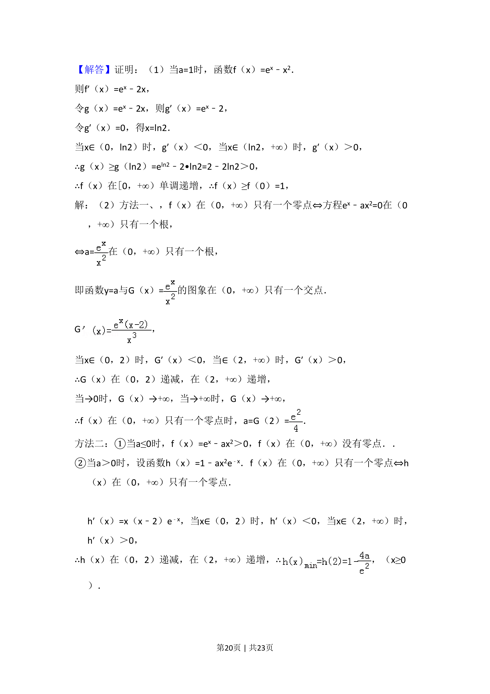
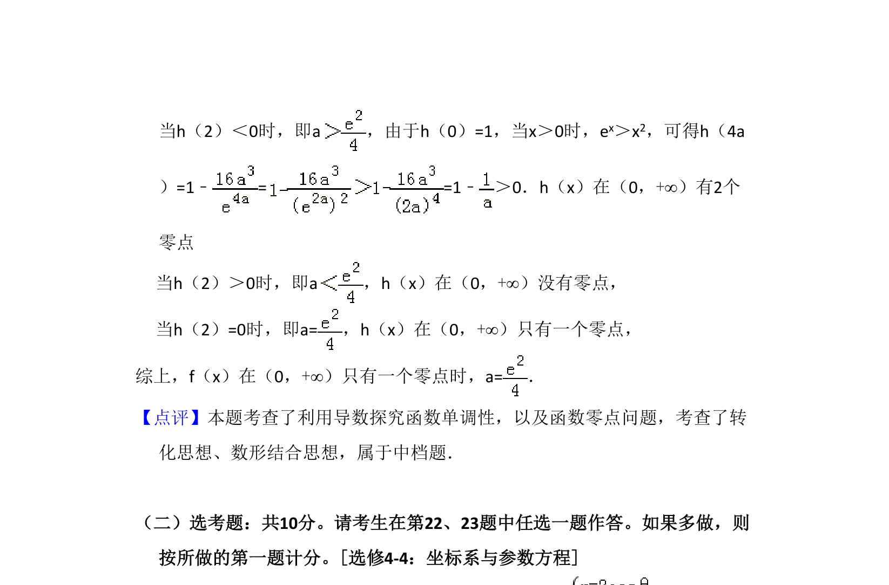

## 题面

## 摘要

通过导数研究含参指数函数的单调性与极值，证明不等式并解决零点个数问题。

## 关联考点

- [[705-利用导数研究函数的单调性|导数与单调性]]
- [[286-函数的最值|极值]]
- [[288-函数零点|函数零点]]
- [[698-分离参数|分离参数]]

## 答案与解析

> 📄 原 PDF 第 19 页：`素材/真题/吉林/2008-2024·（吉林）数学高考真题/2018年高考数学试卷（理）（新课标Ⅱ）（解析卷）.pdf`

<!-- 题干文本-start -->
## 题干文本
21．（12分）已知函数f（x）=ex﹣ax2．
（1）若a=1，证明：当x≥0时，f（x）≥1；
（2）若f（x）在（0，+∞）只有一个零点，求a．
<!-- 题干文本-end -->

<!-- 解析文本-start -->
## 解析文本
【考点】6D：利用导数研究函数的极值．菁优网版权所有
【专题】35：转化思想；49：综合法；53：导数的综合应用．
【分析】（1）通过两次求导，利用导数研究函数的单调性极值与最值即可证
明，
（2）方法一、分离参数可得a=在（0，+∞）只有一个根，即函数y=a与G（x
）=的图象在（0，+∞）只有一个交点．结合图象即可求得a．
方法二、：①当a≤0时，f（x）=ex﹣ax2＞0，f（x）在（0，+∞）没有零点．．
②当a≤0时，设函数h（x）=1﹣ax2e﹣x．f（x）在（0，+∞）只有一个零点⇔h（
x）在（0，+∞）只有一个零点．
利用 
h′（x）=x（x﹣2）e﹣x，可得h（x））在（0，2）递减，在（2，+∞）递增，
结合函数h（x）图象即可求得a．
<!-- 解析文本-end -->
