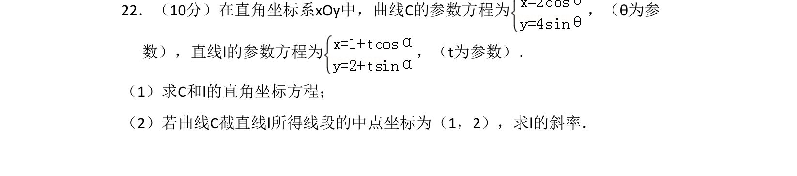
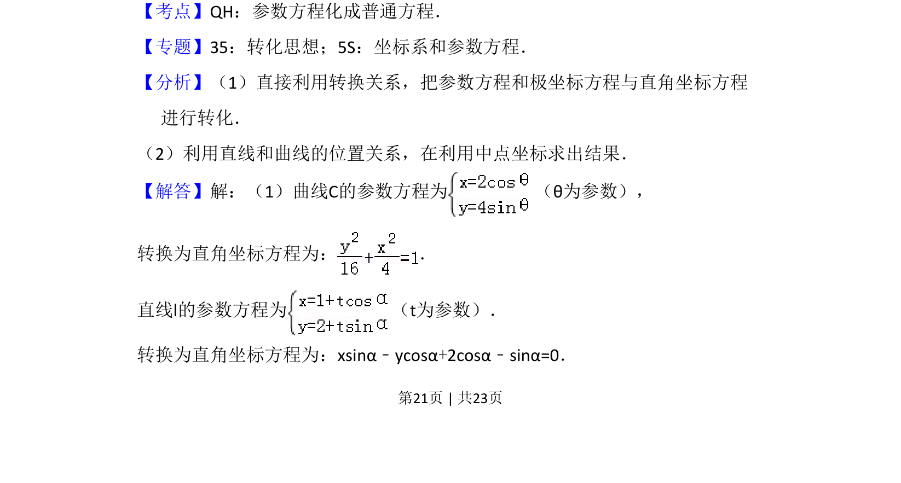
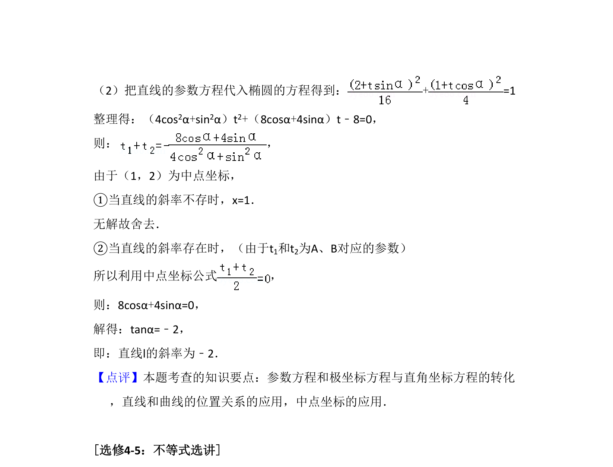

## 题面

## 摘要

参数方程与直角坐标方程互化，结合中点坐标求直线斜率。

## 关联考点

- [[723-参数方程化普通方程|参数方程化普通方程]]
- [[1019-直线与曲线位置关系|直线与曲线位置关系]]
- [[635-中点坐标公式|中点坐标公式]]

## 答案与解析

> 📄 原 PDF 第 21 页：`素材/真题/吉林/2008-2024·（吉林）数学高考真题/2018年高考数学试卷（理）（新课标Ⅱ）（解析卷）.pdf`

<!-- 题干文本-start -->
## 题干文本
22．（10分）在直角坐标系xOy中，曲线C的参数方程为 ，（θ为参
数），直线l的参数方程为 ，（t为参数）．
（1）求C和l的直角坐标方程；
（2）若曲线C截直线l所得线段的中点坐标为（1，2），求l的斜率．
<!-- 题干文本-end -->

<!-- 解析文本-start -->
## 解析文本
【考点】QH：参数方程化成普通方程．菁优网版权所有
【专题】35：转化思想；5S：坐标系和参数方程．
【分析】（1）直接利用转换关系，把参数方程和极坐标方程与直角坐标方程
进行转化．
（2）利用直线和曲线的位置关系，在利用中点坐标求出结果．
【解答】解：（1）曲线C的参数方程为 （θ为参数），
转换为直角坐标方程为： ．
直线l的参数方程为 （t为参数）．
转换为直角坐标方程为：xsinα﹣ycosα+2cosα﹣sinα=0．
<!-- 解析文本-end -->
