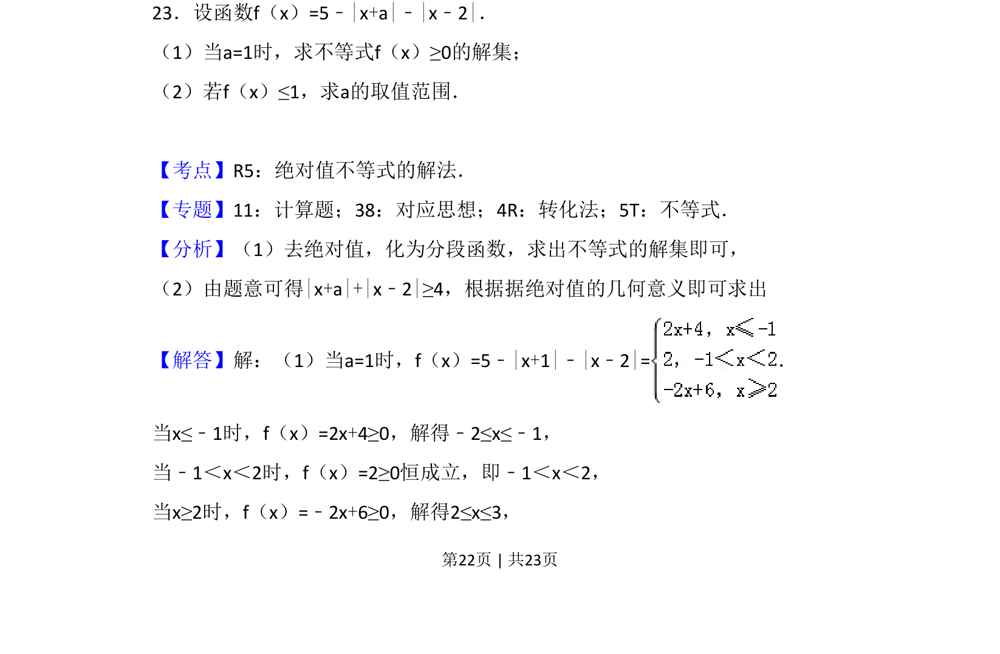
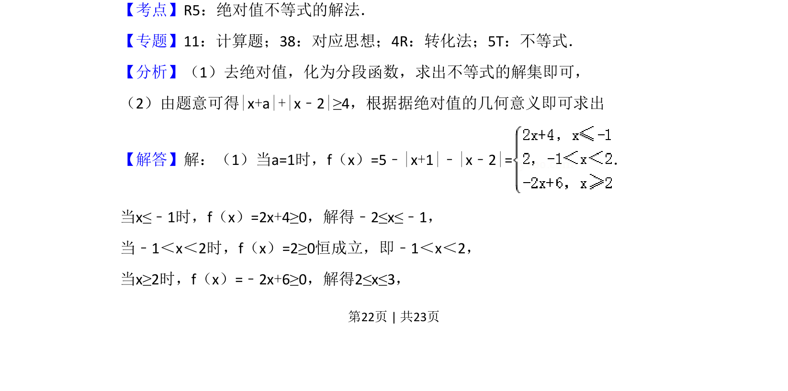
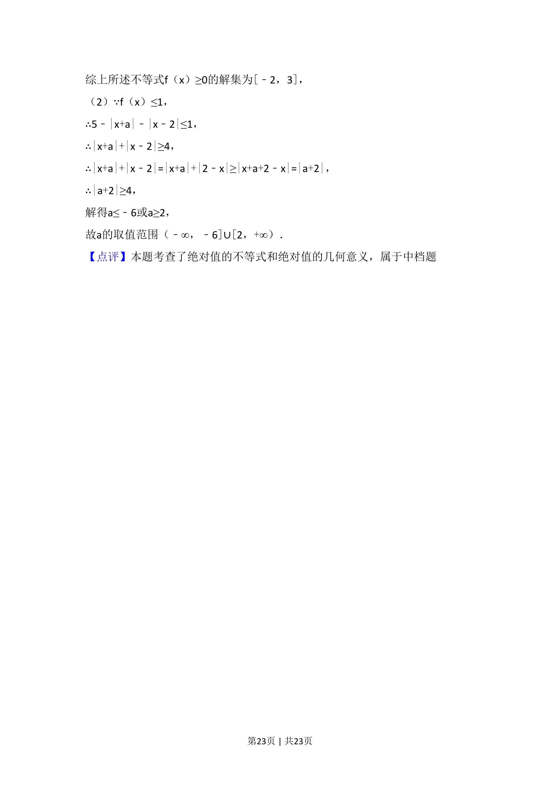

## 题面

## 摘要

考查含一个或两个绝对值不等式的求解集及利用绝对值几何意义求参数取值范围。

## 关联考点

- [[1092-绝对值不等式|绝对值不等式]]
- [[290-分段函数|分段函数]]
- [[424-参数分类讨论|分类讨论]]
- [[1095-绝对值的几何意义|绝对值的几何意义]]

## 答案与解析

> 📄 原 PDF 第 22 页：`素材/真题/吉林/2008-2024·（吉林）数学高考真题/2018年高考数学试卷（理）（新课标Ⅱ）（解析卷）.pdf`
