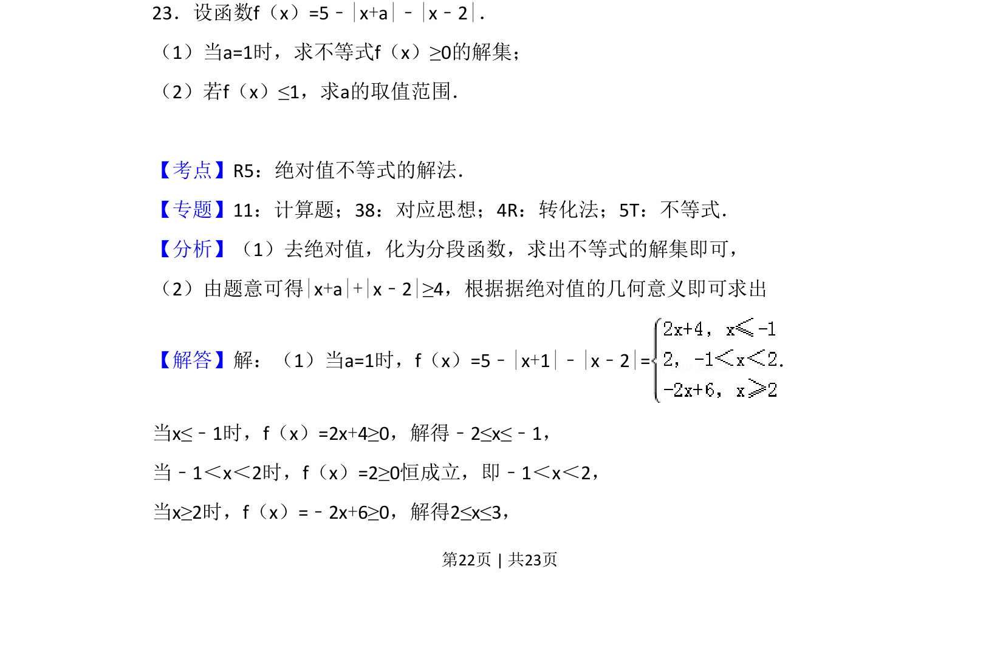
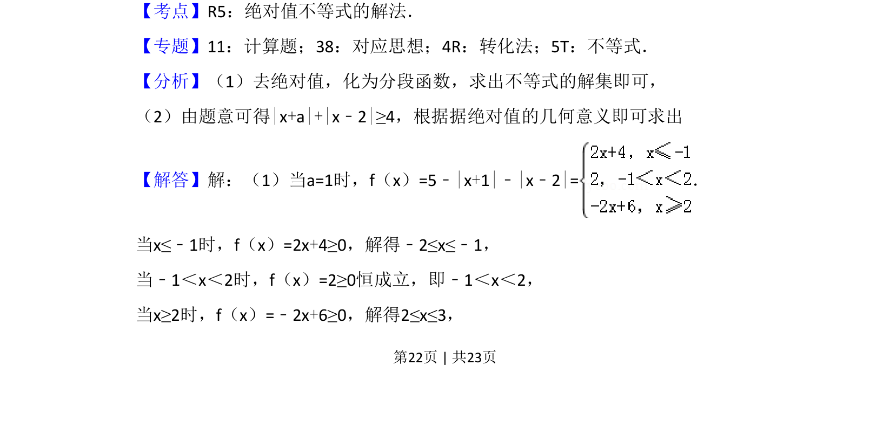
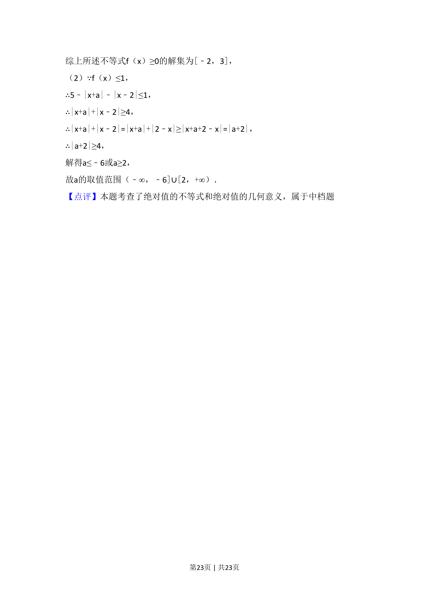

## 题面

## 摘要

考查含一个或两个绝对值不等式的求解集及利用绝对值几何意义求参数取值范围。

## 关联考点

- [[1092-绝对值不等式|绝对值不等式]]
- [[290-分段函数|分段函数]]
- [[424-参数分类讨论|分类讨论]]
- [[1095-绝对值的几何意义|绝对值的几何意义]]

## 答案与解析

> 📄 原 PDF 第 22 页：`素材/真题/吉林/2008-2024·（吉林）数学高考真题/2018年高考数学试卷（理）（新课标Ⅱ）（解析卷）.pdf`

<!-- 题干文本-start -->
## 题干文本
23．设函数f（x）=5﹣|x+a|﹣|x﹣2|．
（1）当a=1时，求不等式f（x）≥0的解集；
（2）若f（x）≤1，求a的取值范围．
<!-- 题干文本-end -->

<!-- 解析文本-start -->
## 解析文本
【考点】R5：绝对值不等式的解法．菁优网版权所有
【专题】11：计算题；38：对应思想；4R：转化法；5T：不等式．
【分析】（1）去绝对值，化为分段函数，求出不等式的解集即可，
（2）由题意可得|x+a|+|x﹣2|≥4，根据据绝对值的几何意义即可求出
【解答】解：（1）当a=1时，f（x）=5﹣|x+1|﹣|x﹣2|=．
当x≤﹣1时，f（x）=2x+4≥0，解得﹣2≤x≤﹣1，
当﹣1＜x＜2时，f（x）=2≥0恒成立，即﹣1＜x＜2，
当x≥2时，f（x）=﹣2x+6≥0，解得2≤x≤3，
<!-- 解析文本-end -->
