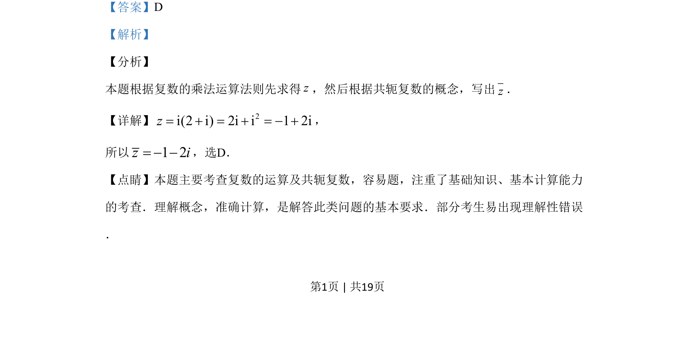

## 题面

## 摘要

本题主要考查复数乘法运算及共轭复数的概念。

## 关联考点

- [[332-复数的乘除运算|复数乘法]]
- [[534-共轭复数|共轭复数]]
- [[793-基本运算|基本运算]]

## 答案与解析

> 📄 原 PDF 第 1 页：`素材/真题/吉林/2008-2024·（吉林）数学高考真题/2019年高考数学试卷（文）（新课标Ⅱ）（解析卷）.pdf`

<!-- 题干文本-start -->
## 题干文本
2.设z=i(2+i)，则z=
A. 1+2i B. –1+2i
C. 1–2i D. –1–2i
<!-- 题干文本-end -->

<!-- 解析文本-start -->
## 解析文本
【答案】D
【解析】
【分析】
本题根据复数的乘法运算法则先求得z，然后根据共轭复数的概念，写出z．
【详解】 2i(2 i) 2i i 1 2iz= + = + = - +，
所以1 2z i= - -，选D．
【点睛】本题主要考查复数的运算及共轭复数，容易题，注重了基础知识、基本计算能力
的考查．理解概念，准确计算，是解答此类问题的基本要求．部分考生易出现理解性错误
．
<!-- 解析文本-end -->
