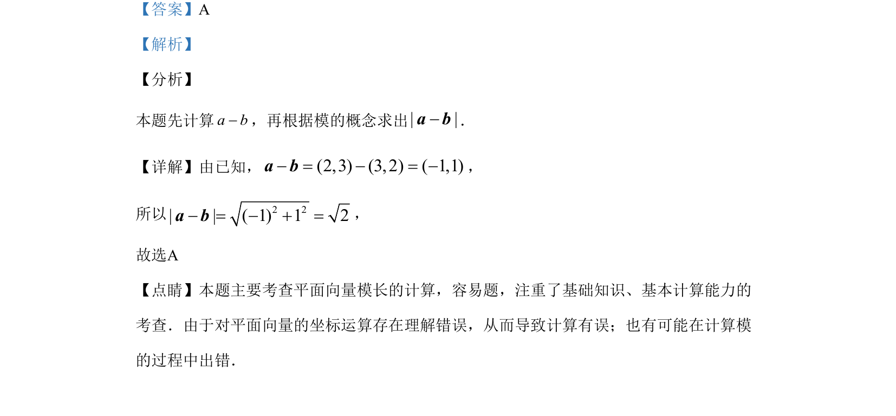

## 题面

## 摘要

本题主要考查平面向量的坐标运算和模长计算。

## 关联考点

- [[335-平面向量坐标运算|平面向量的坐标运算]]
- [[752-向量模长|向量的模]]

## 答案与解析

> 📄 原 PDF 第 2 页：`素材/真题/吉林/2008-2024·（吉林）数学高考真题/2019年高考数学试卷（文）（新课标Ⅱ）（解析卷）.pdf`

<!-- 题干文本-start -->
## 题干文本
3.已知向量a=(2，3)，b=(3，2)，则|a–b|=
A. 2 B. 2
C. 52 D. 50
<!-- 题干文本-end -->

<!-- 解析文本-start -->
## 解析文本
【答案】A
【解析】
【分析】
本题先计算a b-，再根据模的概念求出| |-a b．
【详解】由已知，(2,3) (3, 2) ( 1,1)- = - = -a b，
所以 2 2| | ( 1) 1 2- = - + =a b，
故选A
【点睛】本题主要考查平面向量模长的计算，容易题，注重了基础知识、基本计算能力的
考查．由于对平面向量的坐标运算存在理解错误，从而导致计算有误；也有可能在计算模
的过程中出错．
<!-- 解析文本-end -->
