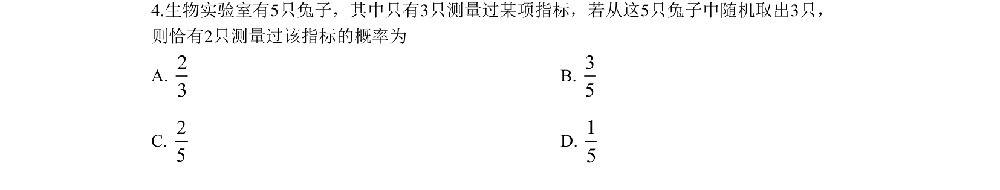
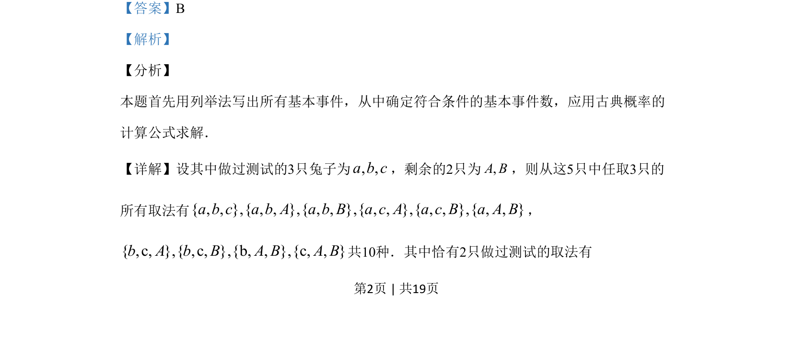
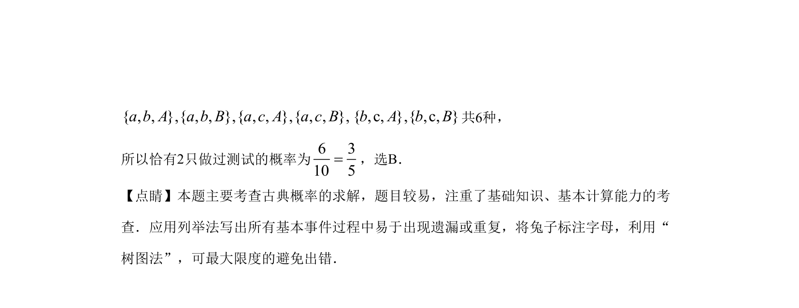

## 题面

## 摘要

本题通过列举法求解从5只兔子中任取3只时恰有2只做过测试的古典概率。

## 关联考点

- [[320-古典概型|古典概型]]
- [[703-列举法|列举法]]
- [[792-基本事件计数|基本事件计数]]

## 答案与解析

> 📄 原 PDF 第 2 页：`素材/真题/吉林/2008-2024·（吉林）数学高考真题/2019年高考数学试卷（文）（新课标Ⅱ）（解析卷）.pdf`

<!-- 题干文本-start -->
## 题干文本
4.生物实验室有5只兔子，其中只有3只测量过某项指标，若从这5只兔子中随机取出3只，
则恰有2只测量过该指标的概率为
A. 23
B. 35
C. 25
D. 15
<!-- 题干文本-end -->

<!-- 解析文本-start -->
## 解析文本
【答案】B
【解析】
【分析】
本题首先用列举法写出所有基本事件，从中确定符合条件的基本事件数，应用古典概率的
计算公式求解．
【详解】设其中做过测试的3只兔子为, ,a b c，剩余的2只为,A B，则从这5只中任取3只的
所有取法有{ , , },{ , , },{ , , },{ , , },{ , , },{ , , }a b c a b A a b B a c A a c B a A B，
{ ,c, },{ ,c, },{b, , },{c, , }b A b B A B A B共10种．其中恰有2只做过测试的取法有
<!-- 解析文本-end -->
