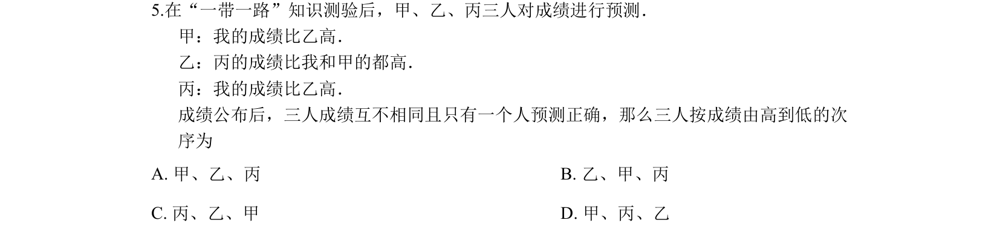
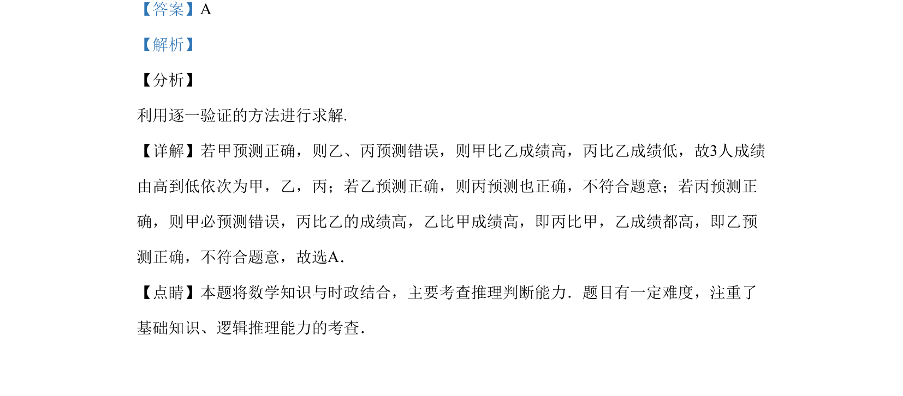

## 题面

## 摘要

本题通过三人成绩预测的推理情境，考查逻辑分析与反证法的应用。

## 关联考点

- [[037-推理|逻辑推理]]
- [[1179-反证法|反证法]]
- [[887-推理判断|推理判断]]

## 答案与解析

> 📄 原 PDF 第 3 页：`素材/真题/吉林/2008-2024·（吉林）数学高考真题/2019年高考数学试卷（文）（新课标Ⅱ）（解析卷）.pdf`

<!-- 题干文本-start -->
## 题干文本
5.在“一带一路”知识测验后，甲、乙、丙三人对成绩进行预测．
甲：我的成绩比乙高．
乙：丙的成绩比我和甲的都高．
丙：我的成绩比乙高．
成绩公布后，三人成绩互不相同且只有一个人预测正确，那么三人按成绩由高到低的次
序为
A. 甲、乙、丙 B. 乙、甲、丙
C. 丙、乙、甲 D. 甲、丙、乙
<!-- 题干文本-end -->

<!-- 解析文本-start -->
## 解析文本
【答案】A
【解析】
【分析】
利用逐一验证的方法进行求解.
【详解】若甲预测正确，则乙、丙预测错误，则甲比乙成绩高，丙比乙成绩低，故3人成绩
由高到低依次为甲，乙，丙；若乙预测正确，则丙预测也正确，不符合题意；若丙预测正
确，则甲必预测错误，丙比乙的成绩高，乙比甲成绩高，即丙比甲，乙成绩都高，即乙预
测正确，不符合题意，故选A．
【点睛】本题将数学知识与时政结合，主要考查推理判断能力．题目有一定难度，注重了
基础知识、逻辑推理能力的考查．
<!-- 解析文本-end -->
