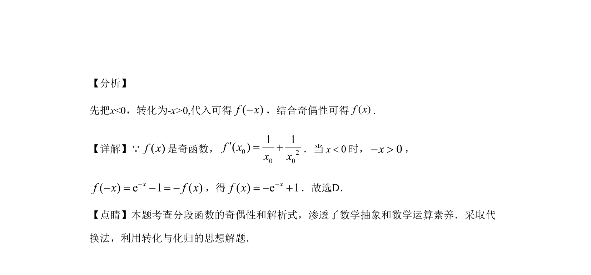

## 题面

## 摘要

考查利用奇偶性求分段函数在对称区间上的解析式，体现转化与化归思想。

## 关联考点

- [[284-函数的奇偶性|奇函数]]
- [[290-分段函数|分段函数]]
- [[693-函数解析式|函数解析式]]
- [[1125-转化思想|转化思想]]

## 答案与解析

> 📄 原 PDF 第 3 页：`素材/真题/吉林/2008-2024·（吉林）数学高考真题/2019年高考数学试卷（文）（新课标Ⅱ）（解析卷）.pdf`
