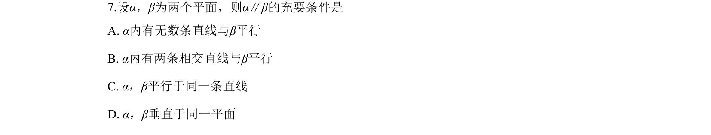
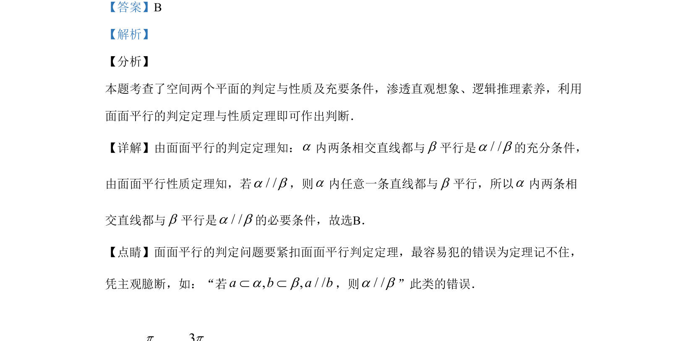

## 题面

## 摘要

本题考查面面平行的判定与性质及充要条件的判断。

## 关联考点

- [[1150-面面平行判定定理|面面平行判定定理]]
- [[1151-面面平行性质定理|面面平行性质定理]]
- [[279-充要条件|充要条件]]

## 答案与解析

> 📄 原 PDF 第 4 页：`素材/真题/吉林/2008-2024·（吉林）数学高考真题/2019年高考数学试卷（文）（新课标Ⅱ）（解析卷）.pdf`

<!-- 题干文本-start -->
## 题干文本
7.设α，β为两个平面，则α∥β的充要条件是
A. α内有无数条直线与β平行
B. α内有两条相交直线与β平行
C. α，β平行于同一条直线
D. α，β垂直于同一平面
<!-- 题干文本-end -->

<!-- 解析文本-start -->
## 解析文本
【答案】B
【解析】
【分析】
本题考查了空间两个平面的判定与性质及充要条件，渗透直观想象、逻辑推理素养，利用
面面平行的判定定理与性质定理即可作出判断．
【详解】由面面平行的判定定理知：a内两条相交直线都与b平行是/ /a b的充分条件，
由面面平行性质定理知，若/ /a b，则a内任意一条直线都与b平行，所以a内两条相
交直线都与b平行是/ /a b的必要条件，故选B．
【点睛】面面平行的判定问题要紧扣面面平行判定定理，最容易犯的错误为定理记不住，
凭主观臆断，如：“若, , / /a b a ba bÌ Ì，则/ /a b”此类的错误．
<!-- 解析文本-end -->
