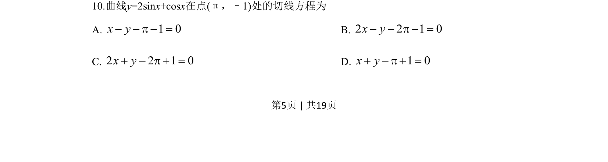
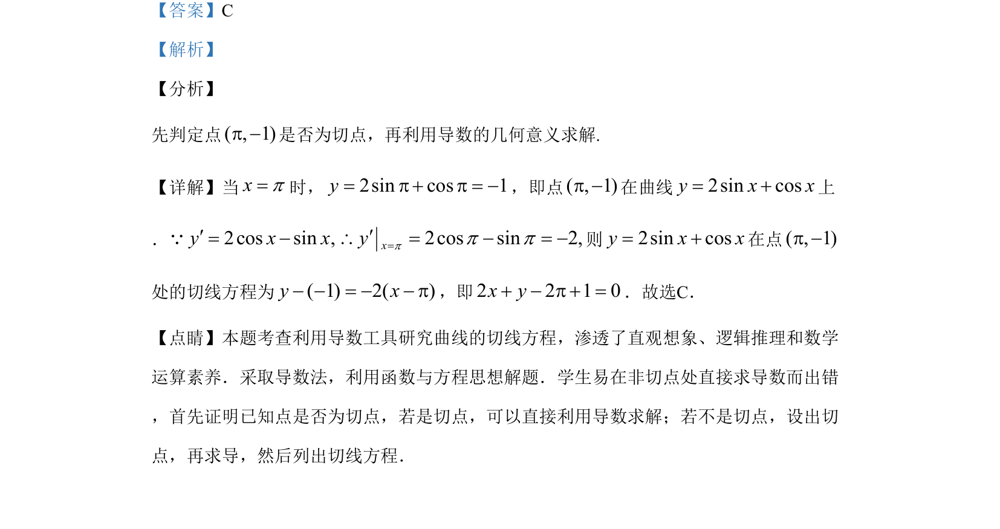

## 题面

## 摘要

本题考查利用导数几何意义求曲线切线方程，需先判定点是否在曲线上并作为切点处理。

## 关联考点

- [[440-导数的几何意义|导数的几何意义]]
- [[422-切线方程|切线方程]]
- [[701-切点判定|切点判定]]

## 答案与解析

> 📄 原 PDF 第 5 页：`素材/真题/吉林/2008-2024·（吉林）数学高考真题/2019年高考数学试卷（文）（新课标Ⅱ）（解析卷）.pdf`
