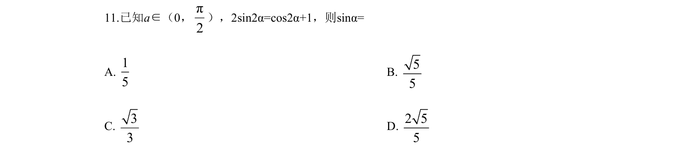
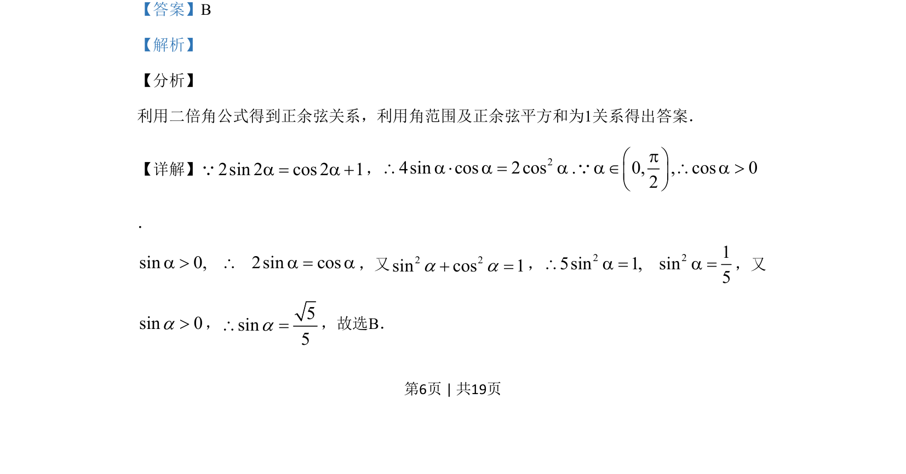
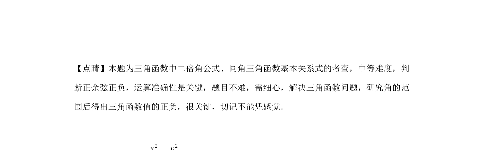

## 题面

## 摘要

本题主要考查利用二倍角公式和同角基本关系求三角函数值，需结合角的范围判断符号。

## 关联考点

- [[637-二倍角公式|二倍角公式]]
- [[741-同角三角函数基本关系|同角三角函数基本关系]]
- [[603-三角函数值符号判断|三角函数值符号判断]]

## 答案与解析

> 📄 原 PDF 第 6 页：`素材/真题/吉林/2008-2024·（吉林）数学高考真题/2019年高考数学试卷（文）（新课标Ⅱ）（解析卷）.pdf`
