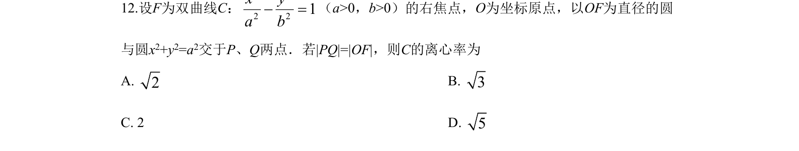
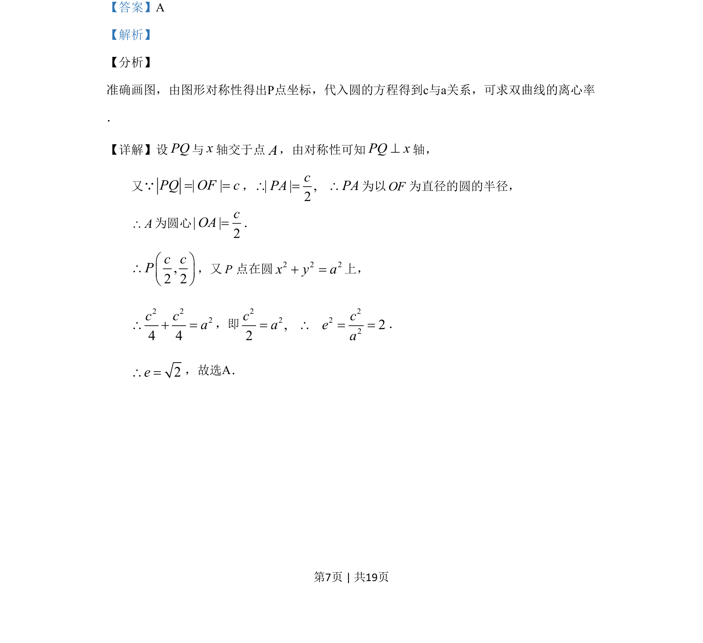
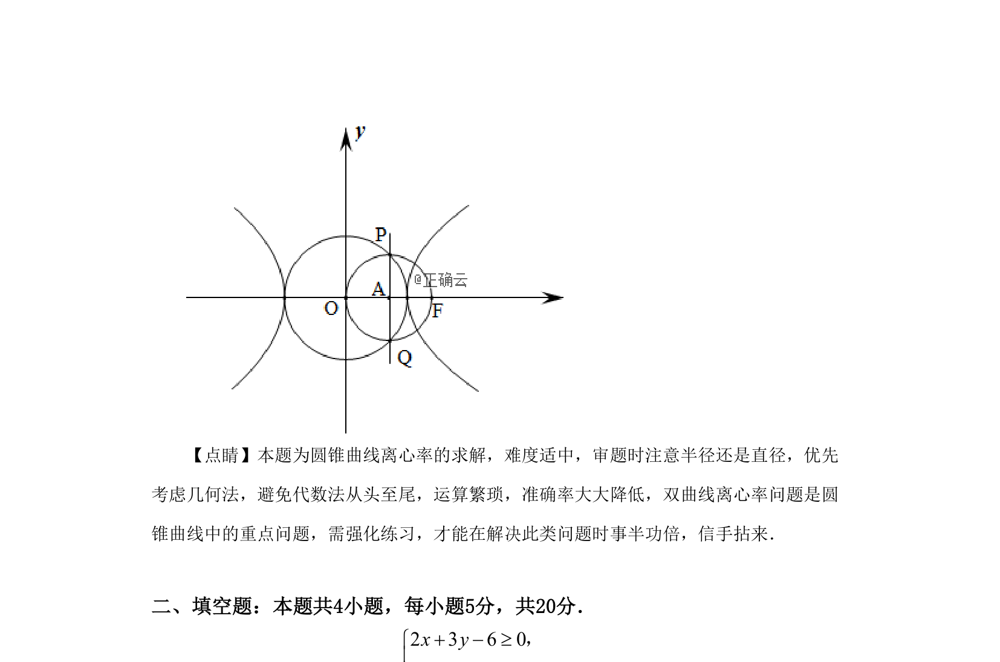

## 题面

## 摘要

本题通过圆的对称性求双曲线离心率，采用几何法简化运算。

## 关联考点

- [[368-双曲线定义与方程|双曲线]]
- [[391-椭圆离心率|离心率]]
- [[圆的方程]]
- [[几何对称性]]

## 答案与解析

> 📄 原 PDF 第 7 页：`素材/真题/吉林/2008-2024·（吉林）数学高考真题/2019年高考数学试卷（文）（新课标Ⅱ）（解析卷）.pdf`
