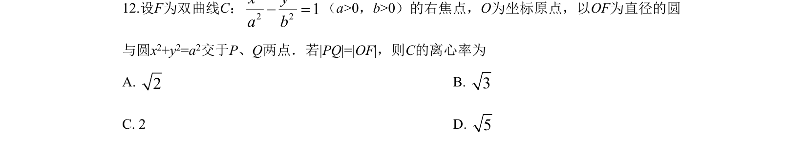
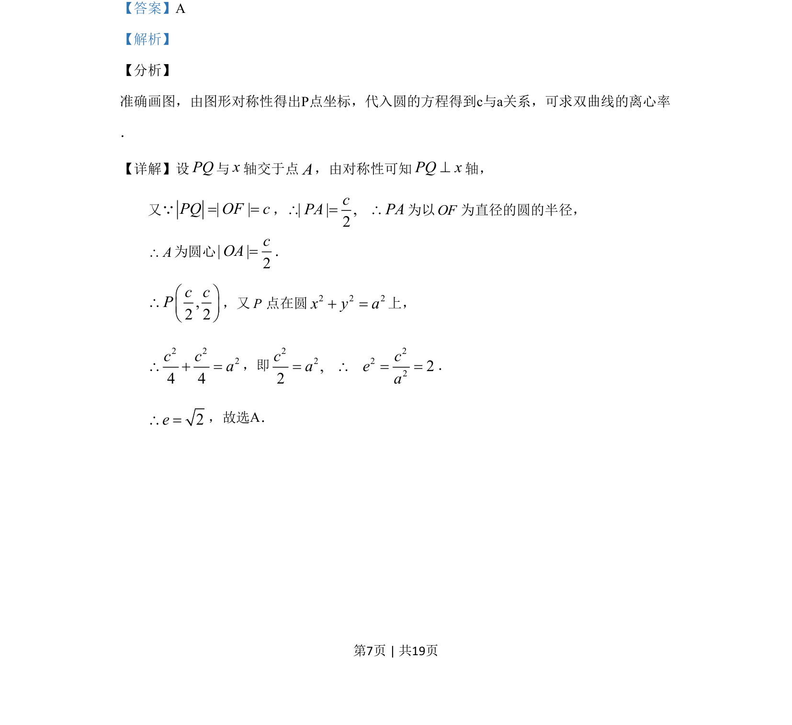
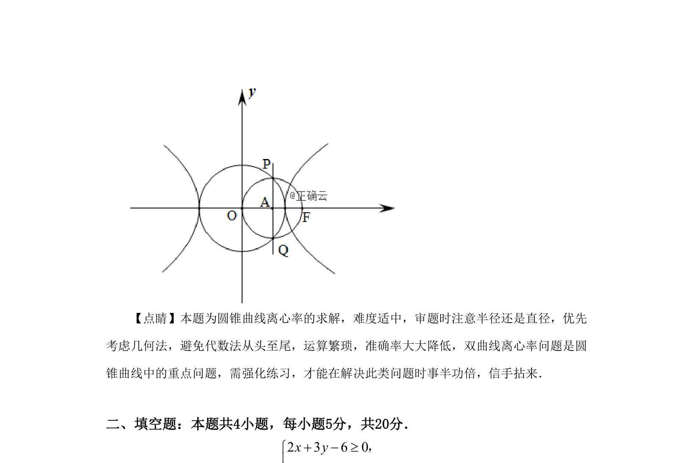

## 题面

## 摘要

本题通过圆的对称性求双曲线离心率，采用几何法简化运算。

## 关联考点

- [[368-双曲线定义与方程|双曲线]]
- [[391-椭圆离心率|离心率]]
- [[782-圆的方程|圆的方程]]
- [[664-几何对称性|几何对称性]]

## 答案与解析

> 📄 原 PDF 第 7 页：`素材/真题/吉林/2008-2024·（吉林）数学高考真题/2019年高考数学试卷（文）（新课标Ⅱ）（解析卷）.pdf`

<!-- 题干文本-start -->
## 题干文本
12.设F为双曲线C：
2 22 21x ya b- =（a>0，b>0）的右焦点，O为坐标原点，以OF为直径的圆
与圆x2+y2=a2交于P、Q两点．若|PQ|=|OF|，则C的离心率为
A. 2 B. 3
C. 2 D. 5
<!-- 题干文本-end -->

<!-- 解析文本-start -->
## 解析文本
【答案】A
【解析】
【分析】
准确画图，由图形对称性得出P点坐标，代入圆的方程得到c与a关系，可求双曲线的离心率
．
【详解】设PQ与x轴交于点A，由对称性可知PQ x^轴，
又| |PQ OF c= =Q，| | ,2cPA PA\ = \为以OF为直径的圆的半径，
A\为圆心| |2cOA=．
,2 2c cPæ ö\ç ÷è ø
，又P点在圆2 2 2x y a+ =上，
2 224 4c ca\ + =，即
2 22 22, 22c ca ea= \ = =．
2e\ =，故选A．
<!-- 解析文本-end -->
