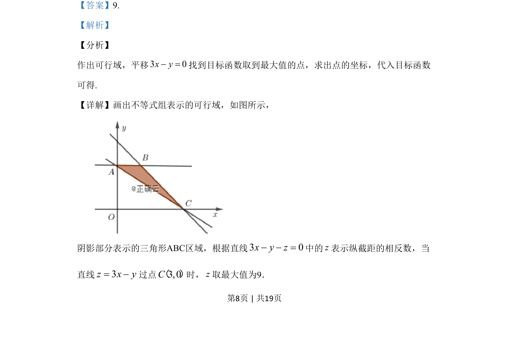
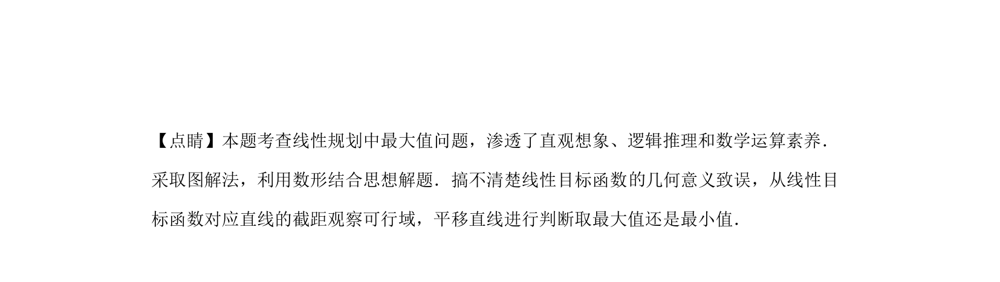

## 题面

## 摘要

本题考查线性规划中目标函数的最大值，通过平移直线求最优解。

## 关联考点

- [[1074-简单线性规划|线性规划]]
- [[1156-可行域|可行域]]
- [[1000-目标函数最值|目标函数最值]]
- [[897-数形结合|数形结合]]

## 答案与解析

> 📄 原 PDF 第 8 页：`素材/真题/吉林/2008-2024·（吉林）数学高考真题/2019年高考数学试卷（文）（新课标Ⅱ）（解析卷）.pdf`
