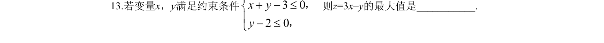
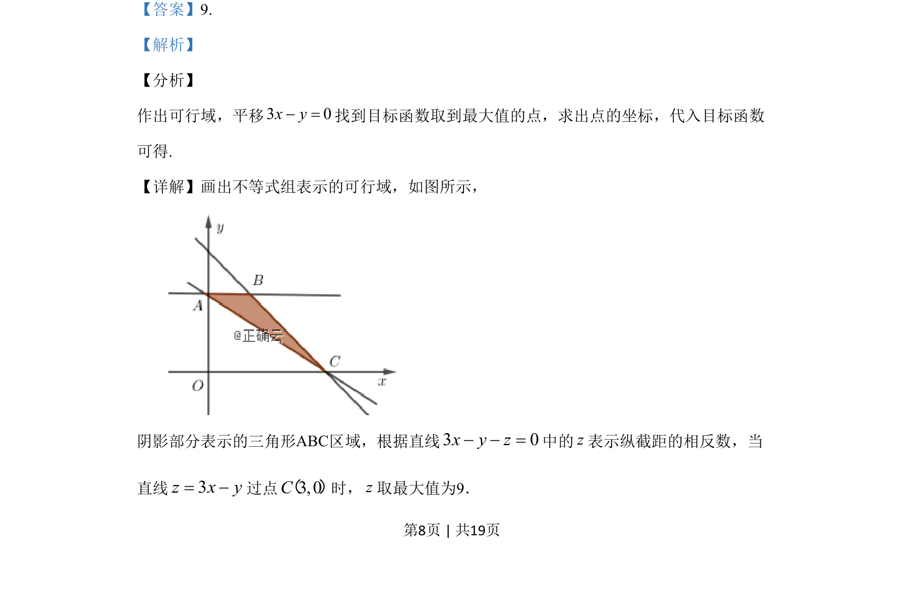
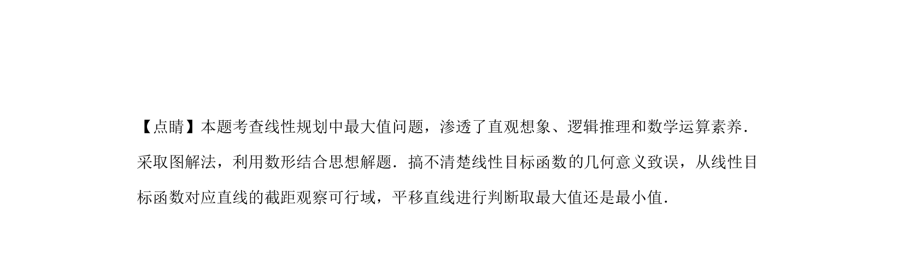

## 题面

## 摘要

本题考查线性规划中目标函数的最大值，通过平移直线求最优解。

## 关联考点

- [[1074-简单线性规划|线性规划]]
- [[1156-可行域|可行域]]
- [[1000-目标函数最值|目标函数最值]]
- [[897-数形结合|数形结合]]

## 答案与解析

> 📄 原 PDF 第 8 页：`素材/真题/吉林/2008-2024·（吉林）数学高考真题/2019年高考数学试卷（文）（新课标Ⅱ）（解析卷）.pdf`

<!-- 题干文本-start -->
## 题干文本
13.若变量x，y满足约束条件
2 3 6 03 02 0x yx yy，，，+ - ³ìï+ - £íï- £î
则z=3x–y的最大值是___________.
<!-- 题干文本-end -->

<!-- 解析文本-start -->
## 解析文本
【答案】9.
【解析】
【分析】
作出可行域，平移3 0x y- =找到目标函数取到最大值的点，求出点的坐标，代入目标函数
可得.
【详解】画出不等式组表示的可行域，如图所示，
阴影部分表示的三角形ABC区域，根据直线3 0x y z- - =中的z表示纵截距的相反数，当
直线3z x y= -过点3,0C（）时，z取最大值为9．
<!-- 解析文本-end -->
