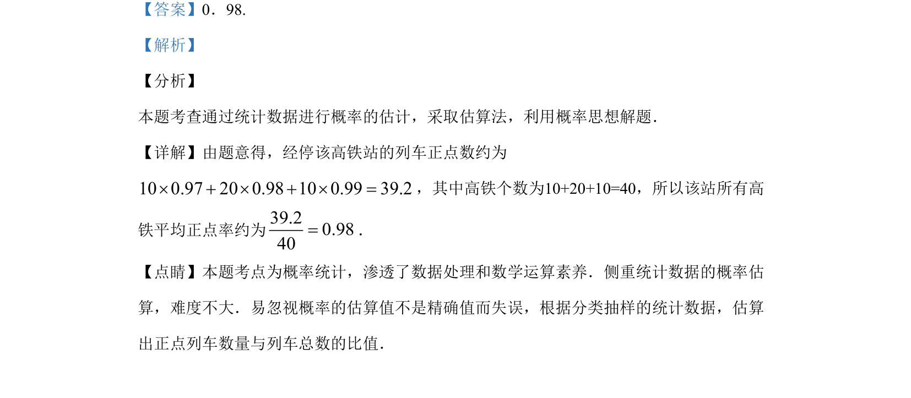

## 题面

## 摘要

已知高铁列车各正点率及对应车次数，求所有车次平均正点率的估计值（加权平均数）。

## 关联考点

- [[055-平均数|加权平均数]]
- [[141-统计图|统计]]
- [[901-数据处理|数据处理]]

## 答案与解析

> 📄 原 PDF 第 9 页：`素材/真题/吉林/2008-2024·（吉林）数学高考真题/2019年高考数学试卷（文）（新课标Ⅱ）（解析卷）.pdf`

<!-- 题干文本-start -->
## 题干文本
14.我国高铁发展迅速，技术先进．经统计，在经停某站的高铁列车中，有10个车次的正点
率为0.97，有20个车次的正点率为0.98，有10个车次的正点率为0.99，则经停该站高铁列车
所有车次的平均正点率的估计值为___________.
<!-- 题干文本-end -->

<!-- 解析文本-start -->
## 解析文本
【答案】0．98.
【解析】
【分析】
本题考查通过统计数据进行概率的估计，采取估算法，利用概率思想解题．
【详解】由题意得，经停该高铁站的列车正点数约为
100.97200.98100.9939.2×+×+×=，其中高铁个数为10+20+10=40，所以该站所有高
铁平均正点率约为39.20.9840=．
【点睛】本题考点为概率统计，渗透了数据处理和数学运算素养．侧重统计数据的概率估
算，难度不大．易忽视概率的估算值不是精确值而失误，根据分类抽样的统计数据，估算
出正点列车数量与列车总数的比值．
<!-- 解析文本-end -->
