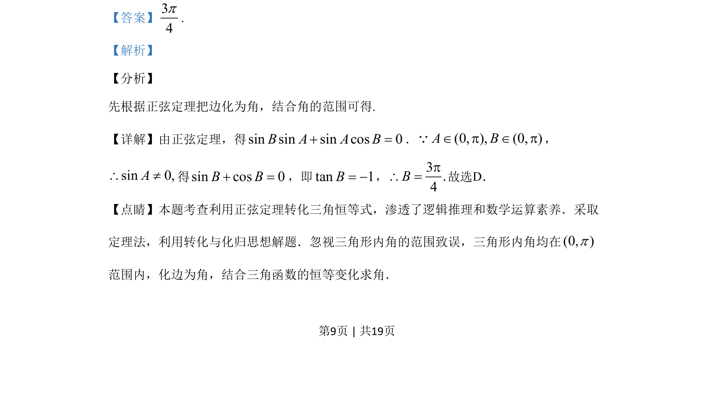

## 题面

## 摘要

利用正弦定理将边角关系转化为三角方程求解三角形内角。

## 关联考点

- [[126-定理|正弦定理]]
- [[272-三角恒等变换|三角恒等变换]]
- [[589-解三角形|解三角形]]

## 答案与解析

> 📄 原 PDF 第 9 页：`素材/真题/吉林/2008-2024·（吉林）数学高考真题/2019年高考数学试卷（文）（新课标Ⅱ）（解析卷）.pdf`
