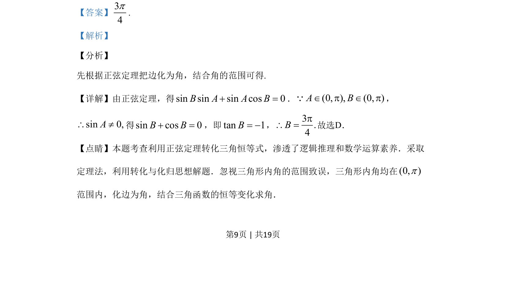

## 题面

## 摘要

利用正弦定理将边角关系转化为三角方程求解三角形内角。

## 关联考点

- [[126-定理|正弦定理]]
- [[272-三角恒等变换|三角恒等变换]]
- [[589-解三角形|解三角形]]

## 答案与解析

> 📄 原 PDF 第 9 页：`素材/真题/吉林/2008-2024·（吉林）数学高考真题/2019年高考数学试卷（文）（新课标Ⅱ）（解析卷）.pdf`

<!-- 题干文本-start -->
## 题干文本
15.VABC的内角A，B，C的对边分别为a，b，c.已知bsinA+acosB=0，则B=_________
__.
<!-- 题干文本-end -->

<!-- 解析文本-start -->
## 解析文本
【答案】34p.
【解析】
【分析】
先根据正弦定理把边化为角，结合角的范围可得.
【详解】由正弦定理，得sinsinsincos0BAAB+=．(0, ), (0, )A BÎ p Î pQ，
sin0,A\得sin cos 0B B+ =，即tan 1B= -，3.4Bp\ =故选D．
【点睛】本题考查利用正弦定理转化三角恒等式，渗透了逻辑推理和数学运算素养．采取
定理法，利用转化与化归思想解题．忽视三角形内角的范围致误，三角形内角均在(0, )p
范围内，化边为角，结合三角函数的恒等变化求角．
的
<!-- 解析文本-end -->
