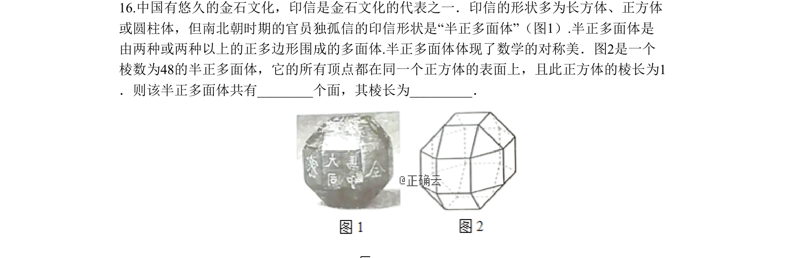
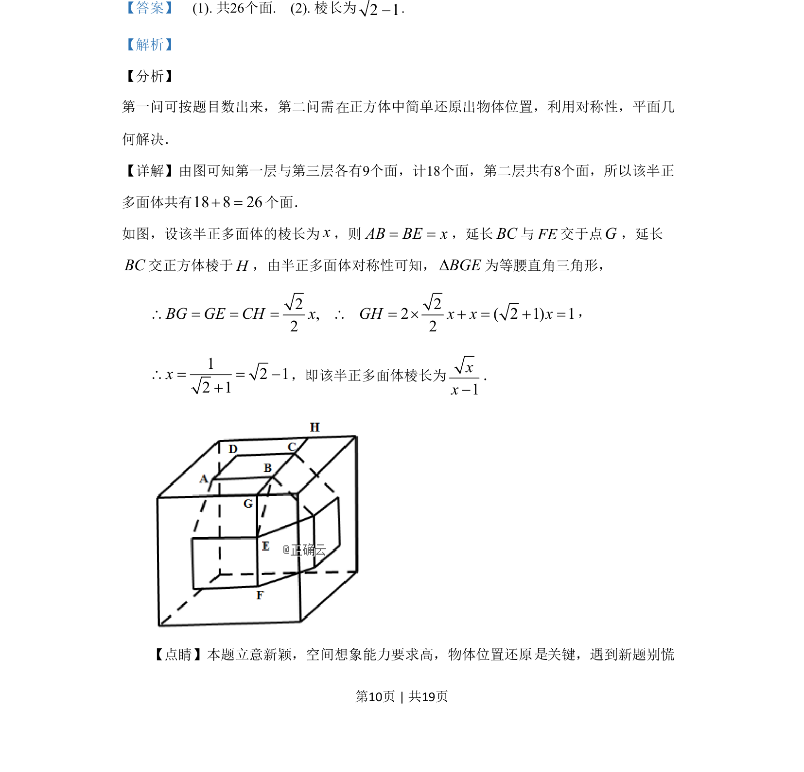
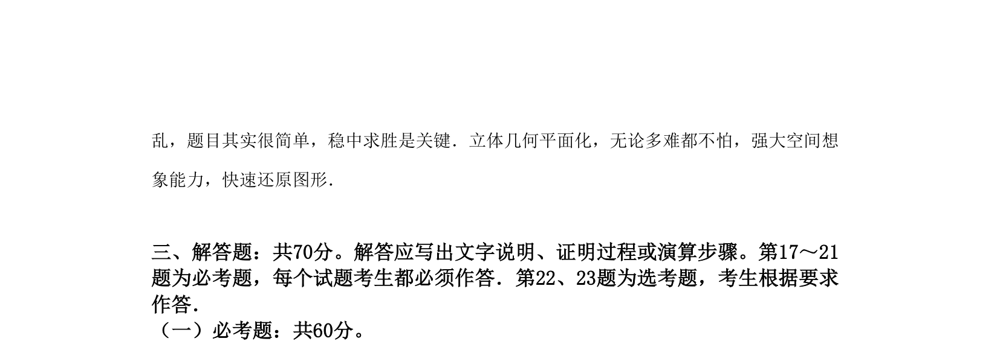

## 题面

## 摘要

该题考查半正多面体的面数计数与借助正方体对称性求棱长，体现空间想象与平面几何转化。

## 关联考点

- [[1056-立体几何|立体几何]]
- [[1055-空间想象能力|空间想象能力]]
- [[852-平面几何|平面几何]]
- [[835-对称性|对称性]]

## 答案与解析

> 📄 原 PDF 第 10 页：`素材/真题/吉林/2008-2024·（吉林）数学高考真题/2019年高考数学试卷（文）（新课标Ⅱ）（解析卷）.pdf`
